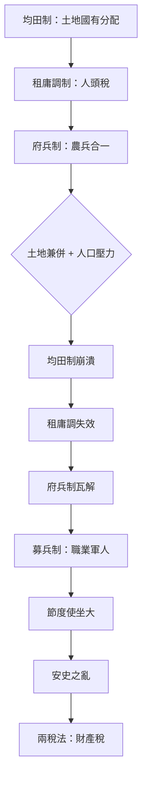

# 唐朝均田制及其制度演變研究

## 一、 歷史背景與核心概念

唐朝的**均田制**是承襲自北魏、北齊、北周及隋朝的土地制度，於唐初發展至成熟完備。其核心在於國家掌握土地所有權，並依人口條件進行「平均分配」，以確保財政稅收、兵源供應及社會基層的穩定。

### 核心性質

- **國家授田**：人民擁有土地的「使用權」，而非完全的私有財產權。
- **身分導向**：受田額度依年齡、性別及社會地位（如官員、平民）而有所差異。

---

## 二、 土地分配結構

唐代均田制將分配的土地分為兩大類，分別對應「國有」與「私有世襲」的平衡：

1. **口分田（主要田產）**：
   - **分配額度**：成年男子（丁男）約授 80 畝。
   - **限制**：**不可買賣**，受田者身故後需歸還國家，重新分配。
   - **功能**：確保農民具備基本生產力，作為國家課稅的基準。

2. **永業田（世襲田產）**：
   - **分配額度**：成年男子約授 20 畝。
   - **限制**：**可傳給子孫**，具備一定程度的私有性。
   - **功能**：維持家族經濟的長期穩定與延續。

---

## 三、 三位一體：均田制、租庸調與府兵制

均田制並非孤立存在，而是唐初「低成本國家模型」的核心基石。它與稅制、軍制緊密聯結，形成穩定的制度鏈結：

### 1. 均田制 → 租庸調制（稅收基礎）

國家授田給農民後，農民需承擔相應稅役：

- **租**：繳納糧食（粟、稻）。
- **庸**：以勞役或布匹代替勞役（解決國家基建需求）。
- **調**：繳納布匹、絲綢或地方特產。

### 2. 均田制 → [府兵制](./府兵制.md)

推行「農兵合一」政策：

- 農民平時務農，戰時徵調為兵。
- 由於擁有土地收入，府兵需自備武裝與軍需。
- 影響：國家無需負擔龐大的常備軍開支，維持了強大的軍事動員能力。

---

## 四、 制度的崩潰與轉折

盛唐中期以後，均田制因內外環境變遷而逐漸瓦解，引發連鎖反應。

### 1. 崩潰誘因

- **人口壓力**：人口暴增導致人均分配土地不足（無田可授）。
- **土地兼併**：官僚與豪強地主大量購併土地，破壞國有分配體系。
- **行政失控**：政府對戶籍與土地的控制力下降，無法有效執行收回與再分配。

### 2. 連鎖崩潰效應

1. **均田制崩**：農民失去土地，流離失所。
2. **租庸調廢**：課稅基礎（土地與人口）失真，國家財政陷入困境。
3. **府兵制亡**：農民無力自備裝備，兵源枯竭。
4. **安史之亂**：中央軍力衰弱，地方節度使（募兵制）坐大，終致大亂。

---

## 五、 制度轉型：兩稅法（西元780年，唐德宗建中元年）

為應對均田制崩潰後的財政危機，宰相楊炎推行「兩稅法」，標誌著中國稅制史的重大轉折。

### 兩稅法核心變動：

- **課稅基準**：由「按人頭」改為「**按資產（土地與財產）**」。
- **徵收頻率**：分為夏、秋兩次徵收，故名「兩稅」。
- **貨幣化**：開始以貨幣折算稅收，反映商品經濟的興起。
- **承認現實**：國家正式承認土地私有化與兼併現象，放棄了「平均分田」的理想。

### 制度對比概覽：

| 項目     | 均田制 + 租庸調 | 兩稅法   |
| -------- | --------------- | -------- |
| 課稅基準 | 人頭            | 財產     |
| 土地制度 | 國家分配        | 私有化   |
| 稅收形式 | 實物 + 勞役     | 貨幣     |
| 國家角色 | 強控制          | 相對放手 |

### 唐朝制度演化鏈結圖：

---

## 六、 歷史評價與研究結論

均田制是唐朝盛世（貞觀、開元）的制度基石，展現了國家對資源的高度整合力。然而，其崩潰揭示了封建國家在面對「經濟發展與土地私有趨勢」時的天然局限。

從「均田制」走向「兩稅法」，是中國歷史從**理想分配型國家**轉向**實務徵收型國家**的關鍵過程。此一轉變深刻影響了後世宋、元、明、清的土地與稅收邏輯。
