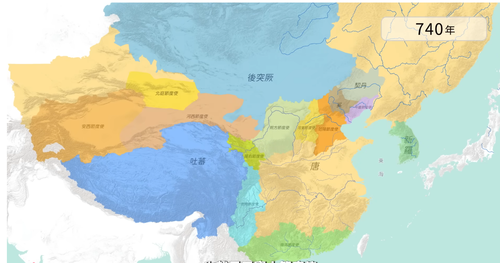

# 籓鎮與節度使制度研究

## 歷史背景

**節度使**（Jiedushi）制度起源於唐睿宗景雲二年（711年），初設為邊疆防禦體系的一部分。至唐玄宗開元、天寶年間（713年－756年），為了應對邊疆強大的軍事威脅（如突厥、契丹、吐蕃、南詔等），唐廷在邊境設立了「天寶十節度使」，賦予其高度的軍政一體化權力。

## 核心內容摘要

### 1. 職能與性質：節度使 vs. 籓鎮

- **節度使（官職名）**：本質上是中央派遣的地方最高軍政長官。
  - **軍權**：統帥軍區部隊，擁有招募與指揮權。
  - **行政權**：兼領採訪使（巡察使），監督地方行政。
  - **財政權**：兼領度支使、營田使，掌握地方賦稅與屯田，用於養兵。
- **籓鎮（勢力範圍）**：由節度使長期控制、逐漸形成半獨立地位的軍事行政區。
  - 「籓」指邊界屏障，「鎮」指軍事重鎮。當節度使不再輪調，其管轄區域即演化為「籓鎮」。

### 2. 歷史轉折點：[安史之亂](../重大事件/安史之亂.md)

安史之亂是籓鎮制度從「邊防」轉向「割據」的關鍵轉捩點。

- **叛亂前**：安祿山身兼平盧、范陽、河東三鎮節度使，實力足以抗衡中央。
- **平叛中**：唐廷為了平定叛亂，不得不廣設籓鎮，並承認部分投降叛將（如河北三鎮）的既得利益。
- **叛亂後**：籓鎮從邊疆向內地擴展，形成了長達一百多年的「籓鎮割據」局面。

### 3. 籓鎮的分類

唐代中後期的籓鎮並非全是割據性質，大致可分為四類：

1. **河朔型**（如魏博、成德、幽州）：具備極強獨立性，官員世襲，賦稅不入中央。
2. **邊疆型**：主要任務為禦邊，如西北與吐蕃接壤處，仍受中央一定程度控制。
3. **中原型**：介於割據與聽命之間，具有屏障中央與牽制河朔的作用。
4. **東南型**：主要是經濟重地，極少有軍事割據，是唐室賴以維生的財政來源。

## 歷史影響與意義

1. **唐朝的衰亡**：唐末籓鎮勢力完全失控，最終由宣武節度使朱溫於907年（唐天祐四年）篡位建立後梁，引發了「五代十國」的長期混亂。
2. **制度的連鎖反應**：籓鎮實行「世襲化」與「私人武裝化」，導致中央權威蕩然無存，皇帝淪為籓鎮實力派的棋子（如唐昭宗時期）。
3. **北宋制度的基石**：宋太祖趙匡胤（曾任殿前都點檢，亦屬武將出身）深受唐末籓鎮割據陰影影響，建國後推行「杯酒釋兵權」、重文輕武與「強幹弱枝」政策，徹底終結了軍閥割據的溫床。

## 研究結論

籓鎮制度最初是為了解決邊疆防禦問題的理性選擇，但由於中央財政與軍事平衡的崩潰，最終演變成地方割據的溫床。節度使從「天子之臣」演變為「地方軍閥」，標誌著唐代中央集權體制的瓦解。理解籓鎮制度，是理解唐代「內輕外重」政治架構及後世宋朝制度變革的關鍵。
