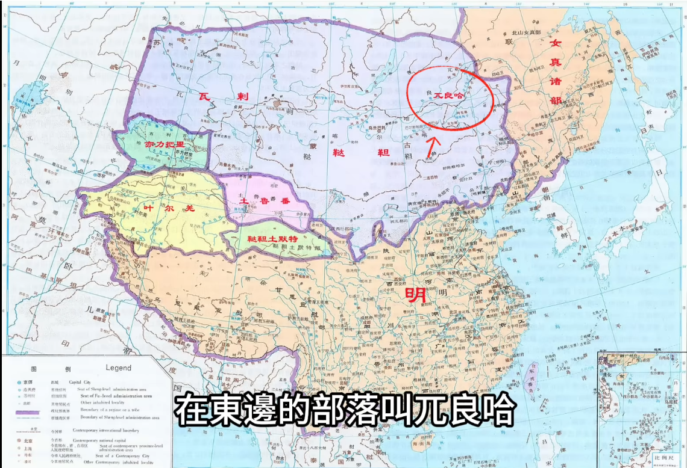

# 仁宣之治

## 事件背景

**仁宣之治**（1424年（明永樂二十二年/洪熙元年）－1435年（明宣德十年）），指[明仁宗朱高熾](../../皇帝/朱高熾.md)與[明宣宗朱瞻基](../../皇帝/朱瞻基.md)父子相繼在位執政的十一年治世。在明代整體大戰略週期中，「仁宣之治」並非傳統意義上的開疆擴土型盛世，而是一場具備高度戰略理性的「糾錯型轉型」。

在[明成祖朱棣](../../皇帝/朱棣.md)永樂時期，朝廷頻繁親征漠北、大興北京城建工程、推動[鄭和下西洋](../朱棣永樂時期/鄭和下西洋.md)以及發動[朱棣征安南](../朱棣永樂時期/朱棣征安南.md)之戰，使得帝國財政瀕臨斷裂邊緣，底層民變頻發。在此嚴峻背景下，仁、宣兩帝展現極高的戰術克制與政治勇氣，推行以「主動戰略制動」為核心的全面煞車國策。仁宗甚至於1425年（明洪熙元年）規劃將都城遷回南京，試圖藉由地理重心的南移徹底削減北方龐大的國防與漕運開支。儘管遷都計畫因仁宗猝逝而擱置，但此一治國方針成功促使大明帝國由緊繃的軍事動員體制平穩過渡至文治官僚體制，修復了社會財政的韌性。

---

## 發展歷程

### 1. 財政修復與休養生息

面對永樂年間累積的財政危機與社會矛盾，仁宣朝廷採取果斷的止損與減負措施，推動財政重組（Fiscal Rehabilitation）：

- **停止高耗能國家工程**：仁宗登基即日下詔停止鄭和下西洋的官船營建，叫停各類海外奢侈品採購，並決定自深陷泥淖的安南戰場撤軍，終止耗資巨萬的交趾征戰，為帝國減去沉重的財政包袱。
- **寬免歷史積欠賦稅**：朝廷下令全額豁免永樂時期積欠的歷年租稅與柴炭稅，嚴禁官吏強徵暴斂。這項措施精準消除了邊緣農民破產流亡的「流民化」風險，引導離散人口復歸農土，使民間生產力迅速復甦，國庫亦隨之充盈。

### 2. 政制革新：三楊內閣與票擬制度成熟化

在楊士奇、楊榮、楊溥（史稱「三楊」）的主持下，明代文官體制走向高度專業化與制度化：

- **票擬機制的標準化**：確立「進呈－票擬－批紅」的三級決策程序。臣工奏章直達內閣，由內閣大學士以墨筆於票簽擬具處理意見（即「票擬」），再呈由皇帝以硃筆裁決審定（即「批紅」）。此一機制實現了國家中樞決策權的專業化分工，極大程度減輕了君主的行政負荷。
- **職等矛盾的體制化化解**：依明代制度，內閣大學士品秩僅為正五品，在法理上難以調度與節制正二品的六部尚書。仁宣朝廷創設「兼職銜制」，賦予內閣大學士兼任尚書、少保或太子三少等崇高銜頭（如楊士奇兼兵部尚書），使決策中樞與各部執行首腦合而為一，化解了職等與實權的體制衝突。

### 3. 地緣收縮：邊界戰略退縮與北方防禦真空

仁宣時期在對外政策上自「積極開邊」轉向「戰略收縮」，雖節省了巨額國防開支，卻也導致地緣防線發生結構性惡化：

- **放棄前線塞外衛所**：政府拒絕了邊臣復設開平、大寧等塞外前線衛所的建議，實質將長城以北的防線全線收縮至長城沿線。此舉主動放棄了戰略緩衝空間，致使原本被成祖遏制的兀良哈部與瓦剌部得以長驅直入、南下蠶食邊疆。
- **外交決策誤判與瓦剌坐大**：1434年（明宣德九年），漠西蒙古瓦剌部大舉東擴，重創韃靼阿魯台部。當韃靼遣使向明廷求援以求維持草原各部均衡時，宣宗卻以「趁人之危非仁義」為由拒絕出兵庇護。明廷的消極不作為坐視瓦剌完全兼併韃靼部，實現漠北部落的初步統一，為日後瓦剌南侵埋下了巨大禍患。

### 4. 權力失衡：內書堂設立與宦官專權萌芽

隨著文官內閣「票擬」體系逐漸成熟，宣宗出於防範文官集團專權的心理，著手建構一套效忠於君主的制衡機制，卻埋下了制度惡化的根源：

- **設立內書堂與批紅權下移**：宣宗於宮內設立「內書堂」，指派翰林官員向宮中內侍教授經史書籍，使宦官具備閱讀與文書處理能力；同時正式將司禮監秉筆太監代筆「批紅」的權限常態化，建立起牽制內閣文臣的內廷行政中樞。
- **制度失衡與幼主危機**：在宣宗親政時期，宦官僅被視為皇權手腕下的家奴祕書；但當宣宗三十八歲驟逝、年僅九歲的[明英宗朱祁鎮](../../皇帝/朱祁鎮.md)繼位後，皇權驟失監管。司禮監太監王振憑藉批紅大權公然踐踏[明太祖朱元璋](../../皇帝/朱元璋.md)「內臣不得干預政事」之祖訓，將盛世累積的國家資產轉化為內廷專擅的籌碼。
- **遠洋秩序瓦解與海防衰弛**：停止鄭和下西洋使明廷主動退出了對東南亞乃至印度洋區域海洋秩序的控管。沿海巡防力量的退縮與海疆控制力的衰竭，為明中後期猖獗的「倭寇之患」埋下了長期的結構性隱患。

---

## 影響與意義

### 1. 治世之「利」：奠定明代中期的文治與社會繁榮

- **民生經濟的復甦動能**：透過果斷終止擴張型戰略工程，推行休養生息與蠲免稅賦，徹底扭轉了永樂末年社會瀕臨破產的頹勢，讓民間生產力在和平環境中得以積累與休養。
- **文官官僚體系的制度定型**：三楊內閣確立的票擬運作準則與文官治理秩序，使明朝政體順利從開國軍功貴族集團主導的軍事擴張體制，平穩過渡為文官行政主導的長治架構，開創出「吏稱其職、政得其平」的黃金十年。

### 2. 治世之「弊」：埋下國運衰退與國防崩潰的禍源

- **消極避戰打破草原均勢**：對外戰略收縮若退化為缺乏有效威懾的消極退縮，必將導致邊防崩潰。坐視瓦剌一統漠北草原，直接鋪就了1449年（明正統十四年）[土木堡之變](../英宗危機與復辟/土木堡之變.md)的歷史悲劇。
- **內書堂摧毀政治制衡架構**：為防範文官而人為培育具有行政與批紅能力的宦官集團，造成明代中後期司禮監與文官內閣相互攻訐、閹黨亂政的體制性死結。

---

## 研究結論

仁宣之治最大的戰略脆弱性在於其嚴重的「個人化」特質，缺乏超越統治者個人壽命的制度韌性。明仁宗在位僅十個月（享年四十八歲），明宣宗在位僅十年（享年三十八歲），兩代君主皆因迷信長生方術、長期服食含重金屬的金丹而英年猝崩。史載宣宗臨終時「肌膚皸裂，如同火上烤魚」，晚年且頻繁出現幻覺，符合典型的汞中毒病理特徵。

這種因君主個人早逝所導致的權力中斷，使得仁宣時期的「糾錯改革」未能沉澱為穩固的長效防禦與分權機制，隨即誘發了「主少國疑」的憲政空轉。宏觀而言，仁宣之治是一場極具政治智慧但也極度脆弱的「戰術性喘息」：它給予了民間寶貴的復甦契機，卻因邊疆戰略的盲目後撤與內廷權力的失控授權，為盛世種下了瓦解的苦果。

---

## 參考資料

1. [參考1](https://www.youtube.com/watch?v=UnpwzqxHgVE)
2. [參考2](https://www.youtube.com/watch?v=S0nIk6GF9pA)
3. [參考3](https://www.youtube.com/watch?v=_-htULweDfA)
