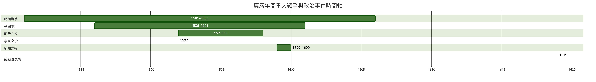
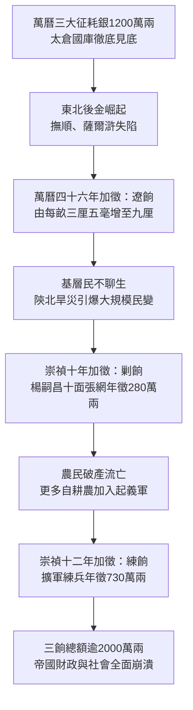

# 萬曆三大征的影響

## 事件背景

1592年（明萬曆二十年）至1600年（明萬曆二十八年），大明帝國在西北邊陲、朝鮮半島及西南山地接連發動了三場大規模軍事行動：平定西北蒙古降將兵變的[寧夏之役](./寧夏之役.md)、跨海抗擊日本豐臣政權侵略的[朝鮮戰爭](./朝鮮戰爭.md)，以及平定西南世襲土司叛亂的[播洲之役](./播洲之役.md)，史稱「萬曆三大征」。

從戰術層面而言，明軍三戰皆捷，展現了強大的跨區域遠征與攻堅戰鬥力。然而，這三場軍事勝利本質上是建立在[張居正](../../人物/文臣/張居正.md)推行[張居正經濟改革](../../經濟/張居正經濟改革.md)所累積的財政儲備與武力紅利之上的一場「極限透支型勝利」。三大征如同對大明帝國進行了一次殘酷的「財政與軍事體系活體解剖」，不僅徹底耗盡了國庫積蓄與邊防精銳，更引發了長期的行政癱瘓與財政死亡螺旋，成為帝國由盛轉衰的決定性歷史轉折點。

| 戰役名稱                      | 爆發時間                                   | 戰略區域                 | 主要對手                           | 明方主要統帥                             | 消耗軍費      | 戰略代價與影響                                                             |
| :---------------------------- | :----------------------------------------- | :----------------------- | :--------------------------------- | :--------------------------------------- | :------------ | :------------------------------------------------------------------------- |
| **[寧夏之役](./寧夏之役.md)** | 1592年（明萬曆二十年）                     | 西北邊陲（寧夏鎮）       | 哱拜、劉東陽（叛變將領與蒙古部眾） | 葉夢雄、魏學曾、李如松、麻貴             | 約 200 萬兩   | 揭露衛所制瓦解與家丁私兵化危機；引黃河水灌城造成區域經濟重創。             |
| **[朝鮮戰爭](./朝鮮戰爭.md)** | 1592年－1598年（明萬曆二十年至二十六年）   | 東北亞（朝鮮半島）       | 豐臣秀吉（日本侵略軍）             | 宋應昌、李如松、邢玠、麻貴、劉綎、鄧子龍 | 約 780 餘萬兩 | 遼東精銳損耗過半，造成東北防禦真空，為女真努爾哈赤崛起提供戰略機遇。       |
| **[播洲之役](./播洲之役.md)** | 1599年－1600年（明萬曆二十七年至二十八年） | 西南邊陲（川黔交界播州） | 楊應龍（世襲宣慰使土司武裝）       | 李化龍、劉綎、馬孔英、吳廣               | 約 300 萬兩   | 動員全國八路大軍24萬人，徹底擊穿中央財政底線，加速西南改土歸流與社會動盪。 |

---

## 發展歷程

### 1. 三大征作戰歷程與軍費透支軌跡

在前後八年的時間內，明朝中央財政承受了前所未有的極限壓力。三大征的軍費開支徹底擊穿了太倉銀庫的承受上限：

- **寧夏之役（1592年）**：耗銀約 200 萬兩。戰事初期因主事文官處置失當與強攻受挫，後期動用決堤引黃河水灌城等極端戰術，修築長堤與善後安置耗費甚鉅。
- **朝鮮之役（1592年－1598年）**：前後歷經「壬辰倭亂」與「丁酉再亂」兩次大規模用兵，總計耗銀高達 780 餘萬兩。其中跨海與長途陸路糧草轉運成本極為驚人，僅第二次戰役的糧餉運輸一項即耗費逾 400 萬兩。
- **播州之役（1599年－1600年）**：調集全國八路精銳共24萬大軍進剿海龍屯天險，耗銀約 300 萬兩。

三場戰役總支出超過 **1,200 萬兩白銀**。當時明朝中央太倉歲入常態僅約 380 萬至 400 萬兩白銀，意味著朝廷在八年內揮霍了整整三年的中央財政收入總額，財政赤字缺口高達 300%，徹底掏空了國庫老底。

### 2. 邊防精銳損耗與遼東戰略真空

職業化精銳部隊是維持邊防穩固的核心支柱。三大征在物理層面摧毀了明代最後一批具備豐富實戰經驗的老兵與基層軍官體系：

- **遼東鐵騎的「去骨化」損耗**：在長達七年的朝鮮戰場上，明廷頻繁抽調北疆核心部隊。以作戰最為勇悍的遼東鎮為例，提督李如松麾下的核心精銳戰死高達兩萬餘人，精銳損耗過半。基層骨幹與軍官的大量陣亡，使遼東鎮防禦體系失去了關鍵的作戰中樞與戰術韌性。
- **東北防禦真空與女真崛起**：當大明主力精銳深陷朝鮮與西南泥淖時，遼東、宣化、大同等九邊重鎮出現了長期的兵力真空與防守虛弱。建州女真首領努爾哈赤精準捕捉到這一歷史性戰略空白期，迅速吞併女真各部、統一建州與海西，完成了後金政權的原始軍事積累。
- **薩爾滸戰敗的歷史必然**：1619年（明萬曆四十七年）爆發的薩爾滸之戰中，明軍四路合擊卻遭努爾哈赤分進合擊、慘敗覆滅。其深層根源在於：當年血戰朝鮮的百戰精銳與將領已凋零殆盡，前線充斥著臨時招募、缺乏訓練與欠餉嚴重的烏合之眾，徹底暴露了軍隊戰鬥力的斷層危機。

### 3. 明末三餉（遼餉、剿餉、練餉）的加派用意與惡性機制

為填補三大征後國庫枯竭的無底深淵，並應對隨後接踵而至的東北邊患與境內民變，明廷被迫打開了向全體農業人口苛捐雜稅的加派大門，形成了遺毒深遠的「明末三餉」：

#### （1）遼餉：應對東北戰事的邊防加派

- **用意與目的**：主要用於應對東北後金（清）勢力的軍事威脅，支付遼東前線龐大的軍餉、城池修築及裝備採購費用。
- **開徵歷程**：1618年（明萬曆四十六年）撫順失陷後，戶部奏請以「抵禦後金、保衛遼東」為名，在全國田賦上每畝加派三厘五毫白銀；隨後因戰局惡化，於萬曆四十七年加至七厘，萬曆四十八年更增至九厘。
- **規模與後果**：至天啟與崇禎年間，遼餉常年徵收額達 500 萬至 600 萬兩，最高峰甚至突破 1,000 萬兩。這項原本名為「臨時應急」的加派，最終演變為尾大不掉的固定田賦負擔。

#### （2）剿餉：鎮壓境內農民起義的軍費加派

- **用意與目的**：用於籌措鎮壓明末李自成、張獻忠等農民起義軍的專項軍事經費，支撐大規模圍剿作戰的機動糧餉。
- **開徵歷程**：1637年（明崇禎十年），兵部尚書楊嗣昌提出「十面張網」戰略，主張調集十萬大軍進行全面圍剿。為了解決激增的軍費，朝廷在全國範圍內開徵「剿餉」，每年加派 280 萬兩白銀，原定開徵三年即停，但因戰火連綿始終無法停止。
- **規模與後果**：剿餉直接加劇了長江流域與中原各省農民的負擔，造成「越剿越多、逼民為寇」的荒謬困境。

#### （3）練餉：編練新軍與擴充常備武力的專項加徵

- **用意與目的**：用於擴充朝廷直屬野戰兵力、訓練邊腹新軍（包括關寧軍與中原各鎮），以期同時應付關外滿清與關內義軍的雙重夾擊。
- **開徵歷程**：1639年（明崇禎十二年），楊嗣昌鑑於前線官兵戰力低下、軍紀渙散，奏請設立專款進行精兵整訓，在全國各項雜稅、門攤、契稅及田賦上追加「練餉」，年額高達 730 萬兩白銀。
- **規模與後果**：練餉的徵收範圍極廣，幾乎囊括所有經濟交易與農田產出，引發工商業與農業經濟的全面窒息。

| 三餉名稱 | 開徵年代                 | 主導提議者       | 徵收用意與目的                                           | 徵收規模（年額）   | 對社會與國運之影響                                   |
| :------- | :----------------------- | :--------------- | :------------------------------------------------------- | :----------------- | :--------------------------------------------------- |
| **遼餉** | 1618年（明萬曆四十六年） | 戶部尚書李汝華等 | 籌措遼東邊防軍費，抗擊後金努爾哈赤與皇太極。             | 500 萬－1,000 萬兩 | 破壞正常田賦秩序，開啟田畝無限加稅先例。             |
| **剿餉** | 1637年（明崇禎十年）     | 兵部尚書楊嗣昌   | 支撐「十面張網」戰略，圍剿關內李自成、張獻忠農民起義軍。 | 約 280 萬兩        | 加深中原及南方農民苦難，促使破產農民大量投奔起義軍。 |
| **練餉** | 1639年（明崇禎十二年）   | 兵部尚書楊嗣昌   | 募集並整訓邊腹新軍，提升常備武力作戰效能。               | 約 730 萬兩        | 稅收名目繁苛，商民俱困，徹底擊垮基層社會承載力。     |

---

## 影響與意義

### 1. 軍事層面：衛所制徹底解體與募兵制的致命陷阱

三大征徹底加速了大明軍事體制的質變與瓦解：

- **[衛所制](../../制度/軍事/衛所制.md)的終結**：明初設計的衛所軍屯體系在萬曆時期徹底淪為具文。軍官侵佔屯田淪為「軍事地主」，軍戶淪為佃農奴僕，軍士大面積逃亡。
- **募兵制的沉重代價**：衛所崩潰後，朝廷在三大征中全面轉向高成本的「募兵制」與依賴總兵個人的「將領家丁制」。募兵制使軍隊徹底演變為「吞噬白銀的怪獸」——有餉則聚、無餉則散，甚至屢屢爆發殺官索餉的兵變（如1601年萬曆二十九年前線士兵因欠餉引發的慘劇）。國家陷入「無銀即無兵，越用兵越加稅，越加稅越缺銀」的結構性死結。

### 2. 財政與社會層面：皇室私蓄、掠奪式經濟與全國內亂

三大征的開銷引發了統治集團內部的劇烈矛盾與掠奪式財政搜刮：

- **內府私庫與國庫的極端撕裂**：當中央太倉面臨數百萬兩軍費赤字時，萬曆皇帝朱翊鈞坐擁數百萬兩內帑私蓄卻堅決不願撥款勞軍。萬曆修建定陵耗銀達 800 萬兩，皇室大婚與冊封動輒耗費數百萬（如福王大婚耗銀 40 萬兩，為常制四倍）；國庫告急求援時，皇帝僅象徵性撥出內帑 10 萬兩。
- **[礦稅](../../制度/礦稅.md)太監與社會動盪**：為彌補內庫消耗，萬曆帝派出大量宦官稅監赴全國各地強徵[礦稅](../../制度/礦稅.md)與商稅，引發了如[雲南礦稅案](./雲南礦稅案.md)、臨清民變、蘇州民變等全國性暴動，嚴重摧殘了江南與東南沿海剛萌芽的工商業。
- **三餉逼變與小冰河期重疊**：三餉加派每年累計轉嫁逾 1,500 萬至 2,000 萬兩白銀，最終全部壓在自耕農與佃農身上。適逢十七世紀明清小冰河期帶來的極端乾旱、低溫與蝗災（陝西連年大旱），農民「交餉則立刻餓死，造反尚有一線生機」，直接引爆了覆滅大明王朝的明末農民大起義。

### 3. 政治與中樞層面：行政真空與「行政鬼城」的持續潰爛

三大征暴露了制度缺陷，但隨後的政治危機讓這些傷口徹底喪失了自我修復的可能：

- **[爭國本](./爭國本.md)引發的朝政癱瘓**：萬曆皇帝因冊立皇太子問題（長子朱常洛與三子朱常洵）與文官集團爆發長達十餘年的[爭國本](./爭國本.md)之爭。皇帝採取極端消極的「怠政」對抗文官，長期不上朝、不批覆奏摺、官缺不補。
- **中樞運作停擺**：在三大征結束後最需要重整國防與財政的十餘年「黃金修復期」內，內閣僅剩一二人，六部尚書多數懸缺，各級地方[巡撫總督](../../制度/巡撫總督.md)與知府無人赴任，整個帝國中樞宛如「行政鬼城」。防務文書石沉大海，邊防經費層層漂沒，使得戰後創傷在暗處持續化膿潰爛。

---

## 研究結論

萬曆三大征在軍事史冊上留下了「三戰皆勝」的耀眼戰績，然而以宏觀歷史視角審視，這實為大明帝國在崩潰前夕所綻放的最後一抹「殘陽餘暉」。

這場跨越萬曆中晚期的戰略全勝，在實質上摧毀了帝國最後的制度韌性：

1. **軍事上**，精銳骨幹在朝鮮與西南戰場消耗殆盡，直接給予後金努爾哈赤坐大崛起的戰略空間；
2. **財政上**，1,200 萬兩的浩繁耗費擊穿國庫，打開了「明末三餉（遼餉、剿餉、練餉）」的加派潘朵拉之盒，製造了不可逆轉的社會極端化；
3. **政治上**，皇權與官僚體系的決裂讓帝國失去了戰後制度修復的能力。

崇禎皇帝最終所接手的，並非一個僅需「勵精圖治」便能重振的國家，而是一個在萬曆年間就已完成「軍事空殼化、財政破產化、行政癱瘓化」的結構性死局。萬曆三大征以「贏了戰役」的表象，換來了「輸掉國運」的歷史悲劇。

---

## 參考資料

1. [參考1](https://www.youtube.com/watch?v=64DKAAdAne0)
2. [參考2](https://www.youtube.com/watch?v=F7NRiZsqsyI)
