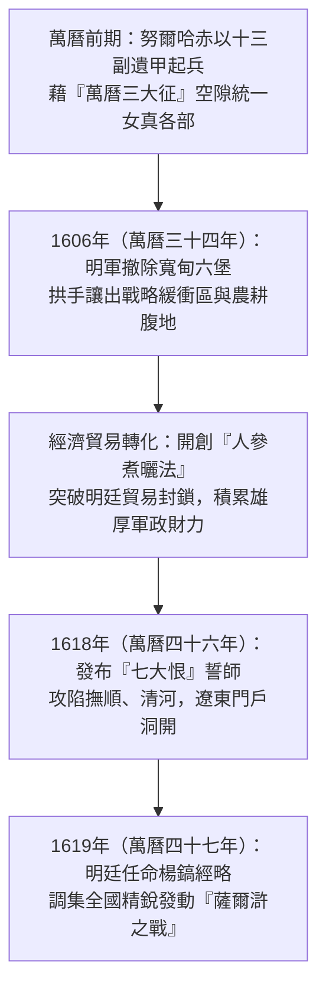
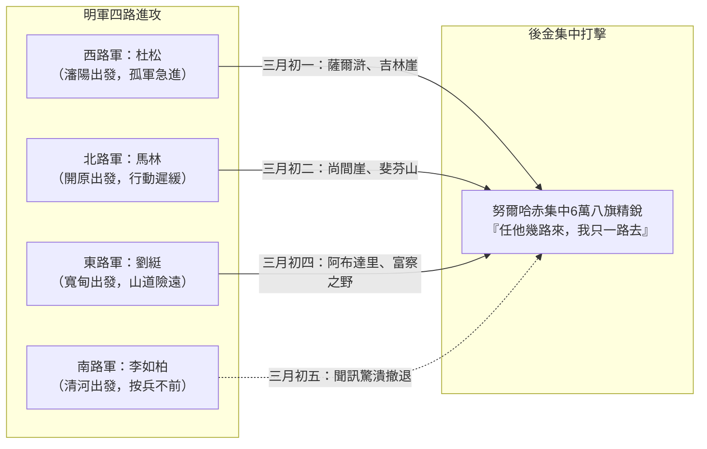
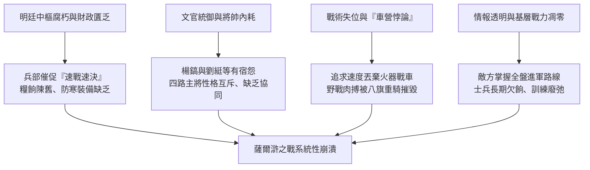

# 薩爾滸之戰

## 事件背景

1619年（明萬曆四十七年），明朝與後金（建州女真）在遼東爆發了一場決定關外統治權乃至明清國運興衰的戰略決戰——薩爾滸之戰。對於萬曆晚期的大明帝國而言，此役是朝廷試圖動員全國精銳、一舉蕩平東北邊患並重塑朝貢秩序的戰略清算；而對後金首領努爾哈赤而言，則是利用明廷政治空隙完成實力積蓄後，向宗主國發起權力挑戰的生死之戰。

### 1. 仇恨與崛起：示忠策略下的實力積蓄

1583年（明萬曆十一年），努爾哈赤的祖父覺昌安、父親塔克世在古勒城之役中死於明軍亂軍。努爾哈赤以父祖遺留的「十三副遺甲」起兵復仇。在崛起初期，面對龐大的宗主國大明，努爾哈赤精明地採取「示忠保境」的策略，頻繁向明廷進貢、遣還逃入關外的漢人俘虜，以極其謙卑的言辭換取明廷信任，獲朝廷冊封為「龍虎將軍」及左都督。

在此期間，明廷的主力部隊與財政資源深陷於西南與海外的「[萬曆三大征的影響](./萬曆三大征的影響.md)」（包括[抗倭援朝戰爭](./朝鮮戰爭.md)、平定西北蒙古降將的[寧夏之役](./寧夏之役.md)與西南[播洲之役](./播洲之役.md)）。這給予了努爾哈赤長達二十餘年的戰略空隙，使其得以迅速吞併建州各部與海西女真，建立八旗制度並完成初期的軍政整合。

### 2. 戰略緩衝的喪失：寬甸六堡的廢棄

1606年（明萬曆三十四年），遼東總兵李成梁鑑於邊備防務空虛，以「地孤難守、首尾不能相顧」為由，奏請朝廷主動撤除具備關鍵制約與防禦功能的「寬甸六堡」（寬甸、長甸、永甸、靉陽、新甸、大平），並強遷當地六萬餘戶邊民入關。

此一戰略退縮造成極其災難性的後果：明朝主動放棄了長達數百里的肥沃土地與邊防縱深，使後金直接獲得了緊鄰遼東平原的戰略跳板與充足的農業資源，徹底抹除了明軍在遼東邊境對建州女真的地理圍堵態勢。

### 3. 經濟貿易戰：人參專賣權與「人參煮曬法」

明朝後期曾試圖透過控制「敕書」配額與惡意壓低關市參價，對女真部落實施嚴厲的經濟制裁。由於傳統新鮮人參不易保存，明廷採取的延期開市與壓價手段一度導致女真商人大量人參霉爛變質。

努爾哈赤隨後推廣「人參煮曬法」（即先將生參煮熟後曬乾製成熟參），極大延長了人參保存期限，成功化解了明廷的市場封鎖。後金藉此全面掌控了關外人參及皮毛的定價權與貿易主導權，將明廷的經濟封鎖反轉為後金的財政紅利，為擴軍備戰累積了充足的白銀與物資儲備。

### 4. 戰爭導火線：從「七大恨」到撫清失陷

1618年（明萬曆四十六年）四月，努爾哈赤自認實力已足，正式發布告天討明檄文「七大恨」，宣布與明朝決裂並大舉進犯。

- **撫順失陷**：後金軍佯裝貿易商人突襲撫順，明朝守將李永方投降（成為明清交戰中首位降金的高級武將）。
- **清河城失守**：副將鄒儲賢率部死守清河城，後金軍在付出慘重傷亡後破城，官兵全數殉國。

撫順與清河的陷落徹底震驚了北京中樞。明廷緊急起用曾參與抗倭援朝戰事的兵部侍郎楊鎬為遼東經略，調集九邊邊防精銳、西南土兵與各省部隊，動員全國之力發動速決清剿，企圖一戰蕩平後金根據地赫圖阿拉。

---

## 發展歷程

### 1. 戰前博弈：明金雙方的戰略部署與體制差異

明軍與後金在動員機制、指揮鏈條與戰略邏輯上存在著根本性的體制代差：

| 評估維度       | 大明帝國軍隊                                         | 後金八旗軍隊                                       |
| :------------- | :--------------------------------------------------- | :------------------------------------------------- |
| **統帥與體制** | 文官統帥經略節制武將，內部掣肘嚴重、決策遲緩         | 軍政合一汗王親自統御，指揮高度集中、反應極快       |
| **兵力構成**   | 動員全國精銳及朝鮮、葉赫聯軍約 11 萬人（號稱 47 萬） | 八旗主力精銳騎步兵約 6 萬人                        |
| **部隊特性**   | 依賴火器與戰車，但南北兵種混雜、各路互不協同         | 兵農合一、重甲步兵與精騎配合，機動性與衝擊力極強   |
| **戰略方針**   | 「四路並進、分進合擊」，試圖合圍赫圖阿拉             | 「任他幾路來，我只一路去」，集中兵力各個擊破       |
| **情報掌握**   | 敵情不明、地圖失準，全線行軍動態完全暴露             | 透過降將李永方與明軍內部間諜，完全掌握明軍作戰日程 |

經略楊鎬制定的「四路並進」部署如下：

1. **西路軍（主攻先鋒）**：
   - **主將**：山海關總兵杜松（配副將王宣、趙夢麟）。
   - **兵力及特點**：約 3 萬人，由瀋陽出發經撫順直撲二道關。杜松作戰勇悍但性格急躁剛愎，素與同僚不協。
2. **北路軍（協同牽制）**：
   - **主將**：開原總兵馬林（配副將麻岩、監軍潘宗顏）。
   - **兵力及特點**：約 1.5 萬人，由三道關出發南下，與西路軍互為犄角。馬林出身將門但性情膽怯畏戰。
3. **東路軍（遠程夾擊）**：
   - **主將**：遼東總兵劉綎（配副將劉昭孫、朝鮮統帥姜弘立）。
   - **兵力及特點**：約 2.5 萬人（含川、鄂、湖、浙南兵及朝鮮軍 1.3 萬），由寬甸深入山林進攻。劉綎作戰經驗豐富，但與楊鎬有舊隙，裝備與後勤最弱。
4. **南路軍（側翼推進）**：
   - **主將**：遼陽總兵李如柏（配副將賀世賢）。
   - **兵力及特點**：約 2.5 萬人，由清河出發向東北推進。李如柏為李成梁之子，因家族與後金有舊且生性遲疑，推進極其緩慢。

面對明軍四路大軍，努爾哈赤採納李永方「任他幾路來，我只一路去」的決策，判定李如柏畏縮、馬林怯戰、劉綎路途遙遠險阻，遂決心集中八旗主力 6 萬精銳，首先全力迎擊威脅最大、孤軍突進的西路杜松部。

---

### 2. 五日決勝：戰役推進與四路潰敗歷程

1619年（明萬曆四十七年）三月初一至初五，在短短五天之內，明朝在遼東經營百餘年的軍事防線被徹底撕碎：

#### （1）西路軍覆滅：毀壩放水與分兵薩爾滸（三月初一）

- **急進中伏**：杜松為爭首功，冒著雨雪強行晝夜兼程。行至薩爾滸河（渾河）時，後金軍預先在河流上游築壩蓄水，待明軍渡河時毀壩放水，導致明軍千餘人溺斃，陣腳大亂。
- **致命分兵**：渡河後杜松犯下兵家大忌，將主力一分為二：自率萬餘精兵進攻吉林崖險隘，留副將王宣、趙夢麟等守薩爾滸山紮營，且將至關重要的火器車營與重炮丟棄在後方的斡昏鄂謨（Wuhun'emo）。
- **血戰陣亡**：努爾哈赤集結六旗主力衝擊薩爾滸營地，明軍無車營掩護，火器僅放一兩輪即遭後金鐵騎衝破，王宣、趙夢麟戰死；隨後八旗軍回師合圍吉林崖。杜松脫甲赤膊短兵搏殺，身中18箭壯烈陣亡，西路軍全軍覆沒。

#### （2）北路軍潰散：主將奔逃與潘宗顏的最後殉國（三月初二）

- **孤軍分營**：北路總兵馬林行至尚間崖得知杜松兵敗，驚懼之下停止前進，就地掘壕列陣，並將兵力分散為三個互不相連的小營（馬林大營、龔念遂營、潘宗顏營）。
- **主帥潰逃**：努爾哈赤抓住其分兵漏洞，先以輕騎衝擊防禦薄弱的龔念遂車營，繼而以全力猛攻馬林主營。馬林臨陣膽怯，棄全軍於不顧，帶少數親信隨從逃回開原。
- **斐芬山死戰**：監軍僉事潘宗顏退守斐芬山，指揮殘部以火器、戰車拼死抵抗，給後金軍造成重大傷亡。然而在後金重甲死士連續強攻下，明軍彈盡糧絕，潘宗顏身中數箭力戰而死，北路軍瓦解。

#### （3）東路軍慘死：阿布達里的南兵血戰（三月初四至初五）

- **誘敵深入**：東路總兵劉綎率川浙步兵深入深山密林三百餘里，因山路阻隔與明軍通訊中斷，對西路與北路的覆滅全不知情。努爾哈赤派人偽裝明軍信使，持杜松令旗誘其冒進。
- **高地伏擊**：三月初四，劉綎部行進至阿布達里山谷（富察之野），遭到代善與皇太極設伏夾擊。山道狹窄使明軍火器難以展開，浙兵、川兵以長槍短刀與八旗重甲步兵肉搏。劉綎年過六旬，面部中刀削去半頰仍斬殺數十人，與義子劉昭孫同殉國難。
- **平壤之約**：隨行的朝鮮將領姜弘立在東路主力覆沒後率殘部五千餘人投降，簽署降約退兵。

#### （4）南路驚潰：恐慌引發的自殘踩踏（三月初五）

- **倉皇撤軍**：南路軍李如柏推進遲緩，三月初五行至虎欄岡時接到經略楊鎬的緊急撤退令。
- **自相踐踏**：部隊撤退過程中，遭遇小股後金偵察哨騎騷擾。全軍頓時陷入極度恐慌，將士奪路奔逃、自相踩踏，墜崖落水死傷千餘人，為五日戰局劃下恥辱句點。

此役明軍陣亡官兵達 **45,870 餘人**，文武將領戰死 **310 餘員**，包括杜松、劉綎、王宣、趙夢麟、潘宗顏等經理戰陣的百戰名將。

---

## 影響與意義

### 1. 敗因深探：明軍潰敗的系統性根源

薩爾滸之戰明軍的慘敗，絕非單純戰術失誤，而是明代晚期政治、財政、人事與軍事體系全面衰朽的必然結果：

- **指揮體系官僚化與文武內耗**：經略楊鎬作為文官統帥，缺乏高超的軍事指揮造詣，且與前線名將劉綎存在長期宿怨，在兵力與裝備分配上嚴重偏私。萬曆皇帝怠政多年，因深懼軍費開支浩繁，嚴令前線「速戰速決」，逼迫部隊在糧草陳腐、棉衣缺乏的情況下倉促出擊。
- **「車營悖論」與戰術失位**：明軍在萬曆年間引進改良了大量佛朗機、大將軍炮與鳥銃，理論上具備壓倒性的遠程火力優勢（[火炮科技興衰](../../制度/軍事/火炮科技興衰.md)）。但在實戰中，杜松為求速度棄車營於斡昏鄂謨，馬林則分散設置車營。缺乏堅固工事與戰車掩護的火器手，在面對八旗重甲步騎兵的高速穿插肉搏時，戰鬥力瞬間瓦解。
- **情報戰完敗與基層戰力凋零**：後金透過投降文武官員（如李永方）及潛伏間諜，精確掌握了明軍出兵時程與各路行軍路線。反觀明軍長期受[衛所制](../../制度/軍事/衛所制.md)崩潰與欠餉影響，基層訓練極度廢弛，甚至出現「三十名火槍手開火僅一發命中」的荒唐現象。
- **將帥性格衝突與地緣孤立**：四路將領性格互不相容——杜松盲勇躁進、馬林怯弱自私、李如柏遲疑依違、劉綎孤立無援。在缺乏近代通訊手段的深山峻嶺中實行「分進合擊」，實質上演變為送給努爾哈赤逐一殲滅的機會。

---

### 2. 國運之變：薩爾滸戰役的深遠影響

薩爾滸之戰是大明帝國關外統治權瓦解的轉捩點，由此引發了一連串毀滅性的連鎖反應：

- **邊防精銳與人才斷層**：明軍一戰喪失了 310 餘名曾參與[萬曆三大征](./萬曆三大征的影響.md)的骨幹軍官與數萬邊防百戰老兵，造成「千軍易得，一將難求」的人才斷層危機。此外，明軍遺留的 **48,600 多匹戰馬、1,000 多輛戰車以及 2 萬多件火器**全數被後金繳獲，直接強化了後金攻城與野戰的火力及機動性。
- **地緣盟友體系崩解**：戰後數月內，明朝在關外的最後屏障海西女真葉赫部被後金徹底吞併；朝鮮王朝在此役後被迫確立中立與臣服取向；蒙古漠南各部見明軍主力覆滅，76 個牛錄紛紛轉投後金。明朝關外藩籬盡失，防線被迫全線退縮至山海關一線，京師直接暴露於後金兵鋒威脅之下。
- **財政黑洞與「三餉死循環」**：為彌補遼東戰事崩潰所帶來的軍事窟窿，明廷被迫於全國加徵「遼餉」（年徵額自 520 萬兩迅速攀升至 660 萬兩以上，晚明累計加派逾千萬兩）。巨額軍費轉嫁至貧苦自耕農與佃農身上，導致北方農村全面破產。失去生計的農民紛紛揭竿起義，明廷為鎮壓民變又加徵「剿餉」與「練餉」，深陷**「加餉→民變→再加餉鎮壓→民變更烈」**的致命財政死循環。
- **遼東防線全盤淪陷**：戰後短短兩年內，開原、鐵嶺、瀋陽、遼陽等 70 餘座重要城堡相繼失陷，明朝徹底喪失了在遼東的所有戰略進攻能力，軍事上由攻轉守，終至無可挽回。

| 影響層面       | 戰役爆發前狀況                       | 薩爾滸戰後格局                                 |
| :------------- | :----------------------------------- | :--------------------------------------------- |
| **戰略攻守**   | 明朝處於主動進攻與戰略清剿態勢       | 後金掌控關外主動權，明軍全線退守城池與關隘     |
| **地緣勢力**   | 具備葉赫部、朝鮮、蒙古諸部的藩籬同盟 | 盟友體系瓦解，後金統一女真並降服朝鮮、整合蒙古 |
| **中央財政**   | 太倉銀庫尚能勉強支撐應急軍費         | 開徵遼餉，引發全國性財政竭蹶與農民破產流亡     |
| **政局與社會** | 朝廷黨爭與怠政，內部矛盾尚在受控範圍 | 財政重壓引爆明末農民大起義，加速帝國滅亡崩潰   |

---

## 研究結論

薩爾滸之戰是明清興亡史上具有分水嶺意義的重大歷史事件。

從戰役本質而言，它是明代政治中樞長期怠政、財政虛耗與文武失調在軍事層面的集中總爆發。楊鎬的「四路並進」在地形複雜、通訊斷絕與情報洩漏的客觀條件下，淪為後金「集中兵力、逐個擊破」的戰術反面教材。

從宏觀歷史維度審視，薩爾滸之戰的失敗給予了後金政權從邊陲部族武裝質變為中原爭霸政權的決定性契機。這場戰役不僅摧毀了明朝在遼東經營二百餘年的軍事防禦體系，更透過沉重的「遼餉」加派，直接點燃了明末農民起義的烈火。大明帝國在此役之後，陷入了關外後金軍事進攻與關內農民暴動的雙向絞殺，其覆亡的命運自薩爾滸漫天硝煙散去之時，便已無可逆轉。

---

## 參考資料

1. [參考1](https://www.youtube.com/watch?v=7K_Mj-t9J8g)
2. [參考2](https://www.youtube.com/watch?v=RTKxrybfuvA)
3. [參考3](https://www.youtube.com/watch?v=juyddJbVkZg)
