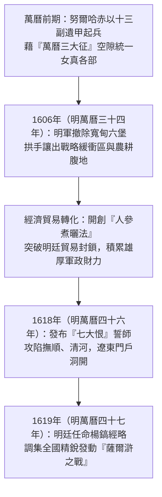
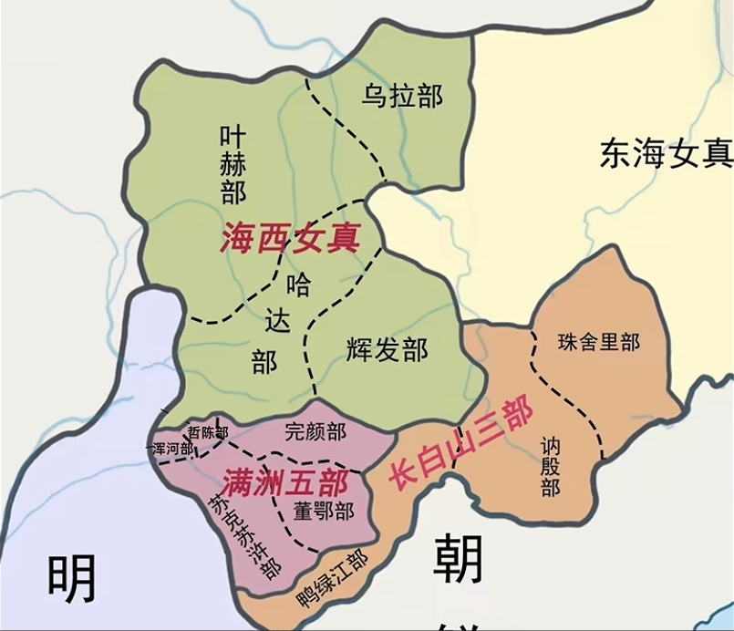
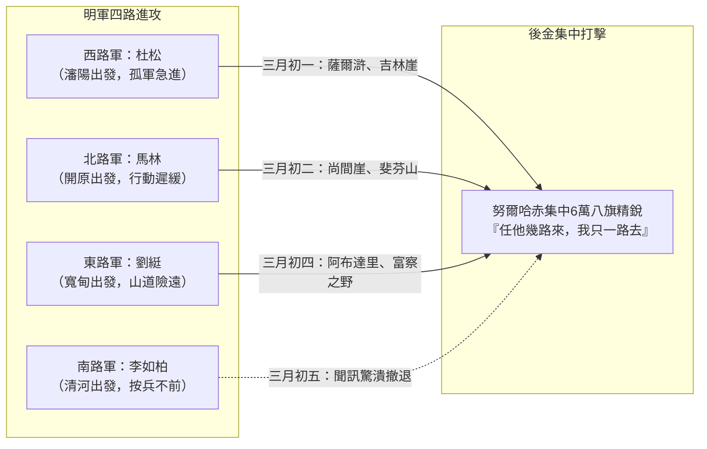
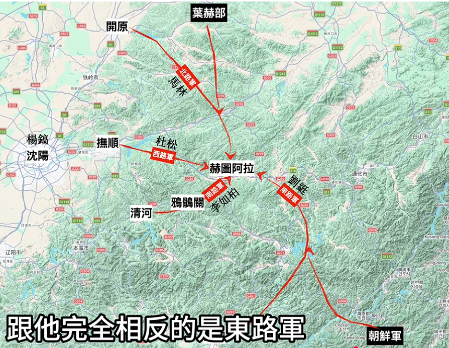
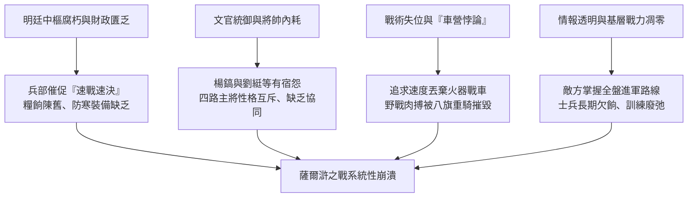

# 薩爾滸之戰

## 事件背景

1619年（明萬曆四十七年），明朝與後金（建州女真）在遼東爆發了一場決定關外統治權乃至明清國運興衰的戰略決戰——薩爾滸之戰。對於萬曆晚期的大明帝國而言，此役是朝廷試圖動員全國精銳、一舉蕩平東北邊患並重塑朝貢秩序的戰略清算；而對後金首領努爾哈赤而言，則是利用明廷政治空隙完成實力積蓄後，向宗主國發起權力挑戰的生死之戰。

```mermaid
flowchart TD
    A["萬曆前期：努爾哈赤以十三副遺甲起兵<br>藉『萬曆三大征』空隙統一女真各部"] --> B["1606年（明萬曆三十四年）：明軍撤除寬甸六堡<br>拱手讓出戰略緩衝區與農耕腹地"]
    B --> C["經濟貿易轉化：開創『人參煮曬法』<br>突破明廷貿易封鎖，積累雄厚軍政財力"]
    C --> D["1618年（明萬曆四十六年）：發布『七大恨』誓師<br>攻陷撫順、清河，遼東門戶洞開"]
    D --> E["1619年（明萬曆四十七年）：明廷任命楊鎬經略<br>調集全國精銳發動『薩爾滸之戰』"]
```

### 1. 仇恨與崛起：女真統一進程與實力積累

1583年（明萬曆十一年），努爾哈赤的祖父覺昌安、父親塔克世在古勒城之役中死於明軍亂軍。努爾哈赤以父祖遺留的「十三副遺甲」起兵復仇。在崛起初期，面對龐大的宗主國大明，努爾哈赤精明地採取「示忠保境」的策略，頻繁向明廷進貢、遣還逃入關外的漢人俘虜，以極其謙卑的言辭換取明廷信任，獲朝廷冊封為「龍虎將軍」及左都督。

在此期間，明廷的主力部隊與財政資源深陷於西南與海外的「[萬曆三大征的影響](./萬曆三大征的影響.md)」（包括[抗倭援朝戰爭](./朝鮮戰爭.md)、平定西北蒙古降將的[寧夏之役](./寧夏之役.md)與西南[播洲之役](./播洲之役.md)）。這給予了努爾哈赤長達三十餘年的戰略空隙，使其得以迅速吞併建州各部與海西女真，實現了總體實力的質變：

| 部族領域                           | 整合過程                                                                               | 戰略資源增益                                                                       |
| :--------------------------------- | :------------------------------------------------------------------------------------- | :--------------------------------------------------------------------------------- |
| **建州女真各部**                   | 努爾哈赤發祥基地，自1583年（明萬曆十一年）起兵後首先完成內部徹底整合。                 | 奠定核心軍事力量，掌控蘇克蘇滸河與混江一帶的高效農業區，提供穩固的糧食與兵源基地。 |
| **海西女真（哈達、輝發、烏拉部）** | 1583年至1616年（明萬曆十一年至四十四年）間，先後遭努爾哈赤武力吞併滅亡。               | 打破部落割據狀態，集權掌控土地、人口與兵器，實現後金軍政實力的幾何級增長。         |
| **海西女真（葉赫部）**             | 截至1616年（明萬曆四十四年）唯一保持獨立並頑強抵抗之部族，仰賴明朝軍事扶持為抵抗前沿。 | 成為明朝牽制努爾哈赤的最後地緣棋子，亦是後金完成女真全境統一所必須掃除的外部障礙。 |

### 2. 後金建國的三大體制支柱

1616年（明萬曆四十四年），努爾哈赤在赫圖阿拉正式建立後金政權，自稱「覆育列國英明汗」（稱汗），標誌著女真政權正式從明朝的邊疆附庸轉變為具備獨立政治合法性的實體。後金政權的建立主要依托於三大體制支柱：

- **組織體系：制度化的八旗軍政合一體制**：八旗制度不僅是軍事編制，更是一套集生產組織、兵源動員與社會統治於一體的嚴密軍政體系。八旗體制將原本分散游牧獵戶社會轉化為具備高度極致動員能力的戰鬥機器，「平時皆民，戰時皆兵」，動員效率遠超明朝的[衛所制](../../制度/軍事/衛所制.md)。
- **經濟轉型：軍屯化農業與混合型經濟體制**：女真傳統經濟為採集、漁獵、畜牧與農業並存的混合體制。努爾哈赤借鑑明朝遼東軍屯經驗，按「牛錄」組織推行大規模屯田並設立官田。農業收成的穩步增長顯著降低了對明朝馬市交易（互市採買農具、耕牛、糧食）的單向依賴，奠定了獨立作戰的物質基礎。
- **政治合法性：統治固化與對明戰略豪賭**：經過三十餘年擴張，努爾哈赤亟需獨立的君主身份（稱「汗」而非稱「皇帝」，既在內部確立唯一君權，又在對明外交上預留彈性斡旋空間），固化對廣大領土與多族群人口的統治，跳脫明朝藩屬武官官職之約束。

### 3. 戰略緩衝的喪失：寬甸六堡的廢棄

1606年（明萬曆三十四年），遼東總兵李成梁鑑於邊備防務空虛，以「地孤難守、首尾不能相顧」為由，奏請朝廷主動撤除具備關鍵制約與防禦功能的「寬甸六堡」（寬甸、長甸、永甸、靉陽、新甸、大平），並強遷當地六萬餘戶邊民入關。

此一戰略退縮造成極其災難性的後果：明朝主動放棄了長達數百里的肥沃土地與邊防縱深，使後金直接獲得了緊鄰遼東平原的戰略跳板與充足的農業資源，徹底抹除了明軍在遼東邊境對建州女真的地理圍堵態勢。

### 4. 經濟貿易戰：人參專賣權與「人參煮曬法」

明朝後期曾試圖透過控制「敕書」配額與惡意壓低關市參價，對女真部落實施嚴厲的經濟制裁。由於傳統新鮮人參不易保存，明廷採取的延期開市與壓價手段一度導致女真商人大量人參霉爛變質。

努爾哈赤隨後推廣「人參煮曬法」（即先將生參煮熟後曬乾製成熟參），極大延長了人參保存期限，成功化解了明廷的市場封鎖。後金藉此全面掌控了關外人參及皮毛的定價權與貿易主導權，將明廷的經濟封鎖反轉為後金的財政紅利，為擴軍備戰累積了充足的白銀與物資儲備。

### 5. 戰爭導火線：從「七大恨」宣誓到撫清失陷

1618年（明萬曆四十六年）四月，努爾哈赤自認軍政實力全面成熟，於赫圖阿拉正式發布告天討明檄文「七大恨」，宣布與明朝決裂並大舉誓師進犯：

- **「七大恨」政治動員**：
  1. 明朝無故殺害努爾哈赤父祖（殺父祖之仇）；
  2. 明朝違反邊界誓約，越界出兵偏袒援助葉赫部；
  3. 明人越界違約砍伐殺害建州人，明廷強索建州抵命並殺害十名建州人；
  4. 明朝為葉赫部撐腰，阻撓婚約致使許配予努爾哈赤之葉赫老女改嫁蒙古喀爾喀部；
  5. 明朝強行驅逐建州人在柴河、三叉堡、安韓等地的耕種人口；
  6. 明朝偏信葉赫部讒言，遣使送文書嚴詞折辱責罵努爾哈赤；
  7. 明朝干涉後金征服哈達部，強令歸還人口致使其復遭葉赫侵凌。
- **起兵背後的深層現實驅動力**：
  - **明朝強勢干預阻礙女真統一**：明廷奉行「以夷制夷」政策，為防建州獨大轉而傾力扶持葉赫。1613年（明萬曆四十一年）努爾哈赤圍攻葉赫時，明朝直接派兵千名攜帶精良火器協防並施加軍事恫嚇，令後金意識到不擊破明朝軍事干涉便無法徹底完成統一。
  - **內部極端飢荒危機轉嫁**：1617年（明萬曆四十五年）夏季建州遭遇罕見毀滅性水災致糧食絕收；至1618年（明萬曆四十六年）春，後金轄區爆發大規模飢荒，剛立國的政權面臨崩潰邊緣。努爾哈赤迫切需要對遼東明朝重鎮發動掠奪性戰爭，搶掠糧穀、生口與金帛，以外部擴張轉移內部生存危機。
- **撫順與清河失陷**：
  - **撫順之戰**：後金軍佯裝馬市商人誘開城門突襲撫順，守將李永方率部投降（明清交戰中首位降金高級將領）。隨後後金設伏大敗遼東總兵張承蔭率領的一萬救援明軍，張承蔭力戰殉國。
  - **清河城失守**：副將鄒儲賢率部死守清河城，後金軍在付出慘重代價後架梯破城，全城守軍殉國。

撫順與清河的相繼失守徹底震驚北京中樞。明神宗[朱翊鈞](../../皇帝/朱翊鈞.md)與兵部緊急起用曾任遼東巡撫的兵部右侍郎楊鎬為遼東經略，調集九邊邊防精銳、西南土兵與屬國援軍，試圖以一場全國性軍事動員一舉蕩平後金根據地赫圖阿拉。

---

## 發展歷程

### 1. 戰前博弈：兵力編成、將帥缺陷與體制差異

明軍與後金在動員機制、指揮鏈條與戰略邏輯上存在著根本性的體制代差：

| 評估維度       | 大明帝國軍隊                                           | 後金八旗軍隊                                       |
| :------------- | :----------------------------------------------------- | :------------------------------------------------- |
| **統帥與體制** | 文官統帥經略節制武將，內部掣肘嚴重、決策遲緩           | 軍政合一汗王親自統御，指揮高度集中、反應極快       |
| **兵力構成**   | 動員全國精銳及朝鮮、葉赫聯軍約 10 萬餘人（號稱 47 萬） | 八旗主力精銳騎步兵約 6 萬人                        |
| **部隊特性**   | 依賴火器與戰車，但南北兵種混雜、各路互不協同           | 兵農合一、重甲步兵與精騎配合，機動性與衝擊力極強   |
| **戰略方針**   | 「四路並進、分進合擊」，外線包圍合擊赫圖阿拉           | 「任他幾路來，我只一路去」，內線機動集中逐個擊破   |
| **情報掌握**   | 敵情不明、地圖失準，全線行軍動態完全暴露               | 透過降將李永方與明軍內部間諜，完全掌握明軍作戰日程 |

#### 明軍多源部隊構成之隱患

明廷此次集結了總計約 10 萬兵力（明軍主力約 8 萬人，朝鮮援軍約 1.3 萬人，海西女真葉赫部盟軍 2,000 人）：

- **遼東在地部隊**：熟悉當地氣候地理與女真作戰風格，但長期受欠餉侵蝕，士氣普遍低落。
- **九邊鎮精銳（宣府、大同、延綏、寧夏、甘肅、固原）**：北方邊防邊兵，長於野戰與對蒙騎作戰，戰鬥力強但調動倉促。
- **內地南兵（四川、浙江、湖廣、山東）**：長於[戚繼光](../../人物/武將/戚繼光.md)留下的步兵車營陣法與火器使用，但南方官兵極度不適應東北早春的冰雪苦寒。
- **外援盟軍**：朝鮮都元帥姜弘立所率 1.3 萬火繩槍與弓弩部隊，以及葉赫部貝勒金台石派出的 2,000 名騎兵。部隊語系、指揮與補給完全不同，從未進行任何戰術磨合。

#### 統帥與四路主將背景評估

| 指揮路線               | 主將                              | 兵力與部隊特點                                             | 戰略性格與潛在缺陷評估                                                                           |
| :--------------------- | :-------------------------------- | :--------------------------------------------------------- | :----------------------------------------------------------------------------------------------- |
| **統帥總指揮**         | 經略 楊鎬                         | 坐鎮瀋陽大本營統籌協調。                                   | 文官出身，擅長後勤輜重但軍略短淺。曾於抗倭援朝蔚山之戰指揮失誤潰敗，且與東路主將劉綎有舊怨。     |
| **西路軍（主攻先鋒）** | 山海關總兵 杜松（配王宣、趙夢麟） | 約 3 萬人，出瀋陽撫順關直撲二道關。邊鎮主力精銳。          | 綽號「杜黑子」，作戰勇悍敢死，但性格急躁暴戾、剛愎自用。戰前揚言「誓擒奴酋」，極易冒進貪功。     |
| **北路軍（協同牽制）** | 開原總兵 馬林（配麻岩、潘宗顏）   | 約 1.5 萬人（含葉赫軍 2,000 人），出開原經三道關南下。     | 名將馬芳之子，好吟詩作文，靠父蔭升遷，缺乏獨立指揮大規模兵團野戰之膽魄與經驗。                   |
| **東路軍（遠程包抄）** | 遼東總兵 劉綎（配劉昭孫、姜弘立） | 約 2.5 萬人（含川浙南兵及朝鮮軍 1.3 萬），由寬甸深入山林。 | 綽號「劉大刀」，平播抗倭百戰名將。但與主帥楊鎬不協，南兵不耐嚴寒，被指派最為險遠狹窄的密林山道。 |
| **南路軍（側翼推進）** | 遼陽總兵 李如柏（配賀世賢）       | 約 2.5 萬人，由清河出發經鴉鶻關東北推進。                  | 李成梁之子，將門世家但生性平庸怯懦、保守觀望，家丁精銳已失，缺乏進取決心。                       |

```mermaid
flowchart LR
    subgraph 明軍四路進攻
        DS["西路軍：杜松<br>（瀋陽出發，孤軍急進）"]
        ML["北路軍：馬林<br>（開原出發，行動遲緩）"]
        LT["東路軍：劉綎<br>（寬甸出發，山道險遠）"]
        LRB["南路軍：李如柏<br>（清河出發，按兵不前）"]
    end

    subgraph 後金集中打擊
        NHHC["努爾哈赤集中6萬八旗精銳<br>『任他幾路來，我只一路去』"]
    end

    DS -->|"三月初一：薩爾滸、吉林崖"| NHHC
    ML -->|"三月初二：尚間崖、斐芬山"| NHHC
    LT -->|"三月初四：阿布達里、富察之野"| NHHC
    LRB -.->|"三月初五：聞訊驚潰撤退"| NHHC
```

### 2. 軍事戰略理論剖析：內線作戰 vs 外線包圍

從現代軍事戰術理論視角審視，薩爾滸之戰是古典戰史上**「內線作戰（Internal Lines）」**擊敗**「外線包圍（External Lines）」**的教科書級戰例：

- **明軍「外線包圍」的致命陷阱**：四路明軍行軍線路相隔數百里山川險阻。在17世紀缺乏無線通訊條件下，傳令騎兵極易遭後金游騎攔截，各路軍隊實質淪為資訊孤島。各路推進速度受地形嚴重制約（西路平坦極快、東路山深極慢），使「分進合擊、同時合圍」的構想徹底淪為空想。
- **後金「內線機動」與「過載打擊」**：努爾哈赤坐鎮中心樞紐赫圖阿拉，以逸待勞。他制定了**「憑爾幾路來，我只一路去」**的方針，利用全騎兵的高機動性，在時間軸上實施機動防禦。後金在整體兵力上處於劣勢（6萬對10萬），但透過內線高速位移，在每一處局部戰場都能集結高達 4 萬至 6 萬的主力，對明軍孤立的一萬餘支部隊形成壓倒性的局部兵力優勢（Local Numerical Superiority），實施毀滅性的過載打擊。

### 3. 五日決勝：四路崩解的實戰全過程

1619年（明萬曆四十七年）三月初一至初五，明廷動員全國精銳發動的清剿戰役在短短五日內全面潰敗：

#### （1）西路軍覆滅：渾河分兵與吉林崖血戰（三月初一）

- **冒進渡河**：杜松為爭取首功，不顧大雪泥濘晝夜疾馳，提早一日推進至薩爾滸河（渾河）。因急於立功，杜松未等後方重裝火炮車營趕上，便將重型火器滯留在斡昏鄂謨，強令部隊徒步渡河。後金軍預先於上游築壩阻水，待明軍半渡時毀壩蓄水狂洩，致明軍溺斃千餘人，隊伍陷入混亂。
- **致命分兵**：渡河後杜松犯下兵家大忌，將主力一分為二：自率萬餘精兵攻打後金險要工事吉林崖，留下副將王宣、趙夢麟等率萬餘人在薩爾滸山下紮營。
- **集中殲滅**：努爾哈赤以兩旗兵力在吉林崖憑險牽制杜松主力，親率六旗精銳主力（約4.5萬人）狂飆突襲薩爾滸大營。明軍無工事與車營掩護，火器僅施放一兩輪即被八旗重甲鐵騎撕裂衝垮，王宣、趙夢麟陣亡。隨後後金主力回師圍攻吉林崖，杜松脫甲赤膊血戰，身中數十箭殞命，西路主力全軍覆滅。

#### （2）北路軍潰敗：品字陣瓦解與潘宗顏殉國（三月初二至初三）

- **分營防禦缺陷**：馬林進抵尚間崖得知杜松全軍覆沒，驚恐之下轉攻為守，就地修壕擺開「品字陣」防護：馬林自駐尚間崖大營、監軍潘宗顏駐斐芬山（分山）、部將龔念遂駐斡山，三營各相距數里，試圖以火器車陣互為犄角。然而分兵導致各營兵力極度分散薄弱（每營僅數千人），大幅削弱了局部陣地火力的集結密度。
- **騎兵逐個衝破**：努爾哈赤審度戰局，親率主力避實擊虛，集中騎兵迅速踏平防禦最弱的龔念遂營；隨後八旗鐵騎全力猛攻馬林尚間崖大營。馬林臨陣膽怯，棄軍帶親隨狼狽逃回開原。
- **斐芬山孤臣血戰**：監軍僉事潘宗顏退守斐芬山，以火器、戰車指揮殘兵死戰不退。後金重甲死士在箭雨掩護下捨命登頂強攻，明軍彈盡糧絕，潘宗顏奮戰中矢殉國，北路軍瓦解。遠道趕來的葉赫部2,000名騎兵聞訊，嚇得立刻撤退。

#### （3）東路軍慘死：阿布達里誘敵與南兵苦戰（三月初四至初五）

- **偽令詐誘冒進**：東路總兵劉綎率軍在深山密林開道推進三百餘里，因通訊斷絕，全然不知西、北兩路已覆沒。努爾哈赤派降兵穿著杜松軍服、手持杜松假令箭偽稱「西路已近赫圖阿拉，急令東路兼程會師」，誘騙劉綎加速前進。
- **險隘合圍**：劉綎中計疾馳，大軍進入阿布達里山谷（富察之野）。山谷地形極度狹窄，明軍火器車陣完全無法展開，隨即遭遇後金貝勒代善與皇太極設伏夾擊。川兵、浙兵以短刀、長槍與八旗重甲步兵貼身肉搏，死傷累累。六十四歲老將劉綎面部中刀削去半頰仍手刃數十人，最終與義子劉昭孫同殉國難。隨行的朝鮮都元帥姜弘立在主力崩潰後率五千餘人投降，東路軍覆沒。

#### （4）南路軍驚潰：倉皇撤軍中的踩踏悲劇（三月初五）

- **遲疑自全**：李如柏南路軍行動遲緩，三月初五行抵虎欄岡時，接到經略楊鎬急令退兵的公文。努爾哈赤在南路其實僅留500人監視關隘。
- **自相踐踏**：部隊倉卒後撤之際，遇後金少數偵察哨騎鳴角追擊，明軍士卒疑為大軍殺到，陷入極度恐慌，將士奪路奔逃自相踩踏，墜崖落水死者千餘人，狼狽退回清河。

薩爾滸之戰，明朝動員全國精銳，最終陣亡文武將吏 **310 餘員**，陣亡士卒達 **45,870 餘人**，損失戰馬 2.8 萬餘匹，火器軍械盡失，關外主力毀於一旦。

---

## 影響與意義

### 1. 敗因深探：明軍潰敗的系統性根源

薩爾滸之戰明軍的慘敗，絕非單純戰術指揮的偶然失誤，而是晚明政治腐朽、財政破產、人事內耗與軍事體系衰變的全面總爆發：

```mermaid
flowchart TD
    A["明廷中樞腐朽與財政匱乏"] --> B["兵部催促『速戰速決』<br>糧餉陳舊、防寒裝備缺乏"]
    C["文官統御與將帥內耗"] --> D["楊鎬與劉綎等有宿怨<br>四路主將性格互斥、缺乏協同"]
    E["戰術失位與『車營悖論』"] --> F["追求速度丟棄火器戰車<br>野戰肉搏被八旗重騎摧毀"]
    G["情報透明與基層戰力凋零"] --> H["敵方掌握全盤進軍路線<br>士兵長期欠餉、訓練廢弛"]

    B --> I["薩爾滸之戰系統性崩潰"]
    D --> I
    F --> I
    H --> I
```

- **文官統御與將帥恩怨內耗**：楊鎬以文官經略節制宿將，在調度上因與劉綎的私人恩怨，刻意將兵力與裝備配置偏私，甚至將劉綎部推向最險惡的山林險境。四路將領性格嚴重割裂——杜松盲勇、馬林怯弱、李如柏觀望、劉綎孤立，中樞缺乏協同與臨機應變指揮。
- **財政枯竭逼迫與「速決戰」盲動**：萬曆帝長年[萬歷怠政](./萬歷怠政.md)，戶部國庫空虛。十萬大軍聚集遼東每日耗費萬金，月支軍餉高達二十餘萬兩。朝廷與言官不斷嚴旨催促楊鎬進軍，甚至發出撤職查辦威脅。楊鎬在糧餉未足、冬春換季嚴寒未解、兵力缺乏磨合的狀況下被逼倉促出關，失去了穩紮穩打的機會。
- **「車營悖論」與戰術失位**：明軍在萬曆年間引進改良了大量佛朗機、大將軍炮與鳥銃，理論上具備壓倒性的遠程火力優勢（詳見[火炮科技興衰](../../制度/軍事/火炮科技興衰.md)）。但在實戰中，杜松為求速度棄車營於斡昏鄂謨，馬林則分散設置車營。缺乏堅固工事與戰車掩護的火器手，在面對八旗重甲步騎兵的高速穿插肉搏時，戰鬥力瞬間瓦解。
- **情報全面單向透明**：後金依靠李永方等投降漢官與細作間諜，對明軍各路出發日期、進軍路線、兵力部署洞若觀火；反觀明軍主帥在瀋陽盲目指揮，對山川地勢與敵情全無所知，戰場態勢全面失衡。

---

### 2. 歷史疑雲澄清：李如柏「通敵」爭議評析

戰後明朝朝野震怒，言官彈劾雪片般湧向南路主將李如柏，指控其「與敵私通、通敵逗留」，李如柏最終在巨大的政治審查與輿論唾罵壓力下，於北京自殺身亡。以現代歷史研究視角客觀審查此案：

- **質疑依據與朝野指控**：
  1. 四路出師，杜松、馬林、劉綎三路均遭重創或陣亡，唯獨李如柏南路主力未遭大創全軍撤回。
  2. 後金在南路僅設置 500 名守軍，顯有「放水」默契。
  3. 李成梁家族長期鎮守遼東，與努爾哈赤家族有數十年深厚私交，李如柏更曾納努爾哈赤之弟蘇克蘇滸之女為妾，被質疑具有姻親庇護關係。
- **歷史實質考證與真相**：
  - 歷史檔案與雙方文獻中，**並無任何實質證據證明李如柏曾私通後金**。
  - 李如柏推進遲緩的本質原因，在於其將門子弟性情平庸保守、臨戰怯懦畏戰。其父親李成梁晚年精銳家丁私兵已消耗殆盡，李如柏所統率多為戰力孱弱的普通邊軍，其深知後金騎兵勇悍，因而不敢孤軍突進。後金南路僅置500兵，係努爾哈赤依據李如柏怯懦性格精確算計的「內線作戰策略」，並非雙方私通。
- **史學結論**：李如柏實為明廷朝政在遭受薩爾滸毀滅性打擊後，朝臣為推卸統帥與中樞決策責任而尋找的**「政治替罪羊」**。

---

### 3. 戰後地緣翻轉與歷史連鎖反應

薩爾滸之戰是東北亞地緣政治與明清易代進程的核心分水嶺：

| 評估層面         | 薩爾滸戰前態勢                                         | 薩爾滸戰後格局之翻轉                                             |
| :--------------- | :----------------------------------------------------- | :--------------------------------------------------------------- |
| **戰略攻守態勢** | 明朝具備戰略進攻主動權，企圖合圍搗毀赫圖阿拉。         | 明朝徹底喪失戰略進攻與野戰能力，被迫全線退入城池關隘死守。       |
| **後金地緣政治** | 後金受明朝與葉赫部南北夾擊，且遭逢內部嚴重水災與飢荒。 | 後金完全掌握關外主動權，吞併葉赫部，完成女真統一，轉入全面進攻。 |
| **關外盟友體系** | 朝鮮、葉赫部與蒙古漠南諸部依附大明，構成關外外圍防線。 | 葉赫滅亡、朝鮮臣服中立、蒙古漠南諸部轉投後金，明朝藩籬盡失。     |
| **明廷中央財政** | 太倉銀庫雖窘迫，尚能勉強支應三大征後續應急開銷。       | 開徵沉重「遼餉」（年加派五百至上千萬兩），財政走向不歸路。       |
| **國內社會矛盾** | 萬曆朝黨爭雖烈，民間農民抗糧尚未形成全國性武裝暴動。   | 遼餉重壓轉嫁至貧農，激起陝北民變，引爆李自成、張獻忠明末大起義。 |

- **邊防防線全盤崩塌**：戰後兩年內，開原、鐵嶺、瀋陽、遼陽相繼陷落，明朝在遼東經營二百餘年的軍事防禦體系徹底瓦解，殘部被迫退守寧遠、錦州與山海關一線。
- **財政黑洞與「三餉死循環」**：為彌補遼東戰事崩潰所帶來的軍事窟窿，明廷被迫於全國加徵「遼餉」（年徵額自 520 萬兩迅速攀升至 660 萬兩以上，晚明累計加派逾千萬兩）。巨額軍費轉嫁至貧苦自耕農與佃農身上，導致北方農村全面破產。失去生計的農民紛紛揭竿起義，明廷為鎮壓民變又加徵「剿餉」與「練餉」，深陷**「加餉→民變→再加餉鎮壓→民變更烈」**的致命財政死循環。

---

## 研究結論

薩爾滸之戰是明清興亡史上具有分水嶺意義的重大歷史事件。

從戰役本質而言，它是明代政治中樞長期怠政、財政虛耗與文武失調在軍事層面的集中總爆發。楊鎬的「四路並進」在地形複雜、通訊斷絕與情報洩漏的客觀條件下，淪為後金「內線機動、集中兵力、逐個擊破」戰術的經典反面教材。努爾哈赤憑藉優異的戰略定力、嚴密的八旗制度整合以及極致的機動作戰，成功化解了生存危機。

從宏觀歷史維度審視，薩爾滸之戰的失敗給予了後金政權從邊陲部族武裝質變為中原爭霸政權的決定性契機。這場戰役不僅摧毀了明朝在遼東經營二百餘年的軍事防禦體系，更透過沉重的「遼餉」加派，直接點燃了明末農民起義的烈火。大明帝國在此役之後，陷入了關外後金軍事進攻與關內農民暴動的雙向絞殺，其覆亡的命運自薩爾滸漫天硝煙散去之時，便已無可逆轉。

---

## 參考資料

1. [參考1](https://www.youtube.com/watch?v=7K_Mj-t9J8g)
2. [參考2](https://www.youtube.com/watch?v=RTKxrybfuvA)
3. [參考3](https://www.youtube.com/watch?v=juyddJbVkZg)
4. [參考4](https://www.youtube.com/watch?v=EtwCn802hcs)
