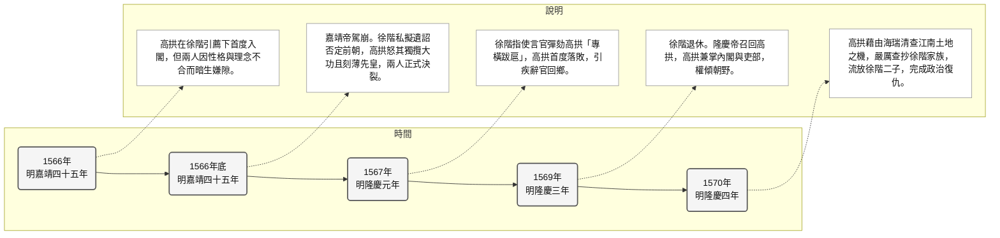

# 高拱

## 歷史背景

明朝中後期，特別是嘉靖至隆慶年間，大明帝國正面臨著嚴峻的內憂外患。在政治上，[明世宗朱厚熜](../../皇帝/朱厚熜.md)（嘉靖帝）晚年沉迷於玄修道教，朝政長期被權臣[嚴嵩](./嚴嵩.md)父子把持，導致官場綱紀廢弛、派系林立，大明國家機器腐敗不堪。在軍事上，帝國面臨「北虜南倭」的雙重威脅，北方蒙古俺答汗的騎兵不時南下騷擾，南方沿海則有倭寇橫行。同時，黃河等水患頻繁，國庫虛空，社會經濟面臨崩潰邊緣。

---

## 核心生平與事蹟

### 1. 命運轉折：從差點選為駙馬到進士及第

- **險為駙馬**：1528年（明嘉靖七年），年僅16歲的高拱因容貌俊美、學識超群，在為永淳公主挑選駙馬時差點被圈定。明朝為了防止外戚干政，規定駙馬必須出身寒門，且一經中選便終身不得出仕核心權力。幸運的是，嘉靖帝之母蔣太后作風務實，認為美男子大多華而不實，最終選了另一位參選者謝昭（後被發現為禿頭）。高拱因而避開了成為「富貴閒人」的命運，保全了政治抱負。
- **進士及第**：13年後的1541年（明嘉靖二十年），高拱成功考中進士（辛丑科），正式開啟了他的官僚生涯。

### 2. 潛龍在淵：九年裕王府的帝師深情

1552年（明嘉靖三十一年），高拱被選入裕王府（即後來的隆慶皇帝朱載坖）擔任講官。當時的裕王朱載坖因不受父親嘉靖帝喜愛，處境極其尷尬且險惡，隨時有被廢黜的危險。高拱在王府陪伴了裕王整整九年，不僅教授治理國家的實務學問，更在精神上給予裕王極大的支持與庇護。這段九年的帝師情誼，成為高拱日後重返朝堂、執掌大權最堅實的政治靠山。

### 3. 與徐階的政治決裂：大明朝堂的頂級內鬥

高拱在首輔[徐階](./徐階.md)的引薦下首度入閣，但這對昔日的政治盟友很快演變成不共戴天的仇敵。這場大明內閣頂級內鬥的成因與歷程如下：

#### 決裂原因

- **「恩人自居」與「拒當小弟」的權力衝突**：[徐階](./徐階.md)自認對高拱有知遇之恩，期望高拱能順從地作其政治附庸。但高拱性格極度驕傲，深知徐階的拉攏是看中自己身為「未來皇帝老師」的政治潛力。因此，高拱入閣後事事與[徐階](./徐階.md)平起平坐，甚至針鋒相對，令習慣被順從的[徐階](./徐階.md)深感不悅。
- **「沽名釣譽」與「務實實幹」的理念鴻溝**：[徐階](./徐階.md)行事極為注重名聲與表面功夫，善用政治正確維護個人形象；高拱則是堅定的實幹派，極度鄙視虛浮的官場作風與空談，認為徐階「虛偽、沽名釣譽」。

#### 衝突歷程

- **嘉靖遺詔事件的公開決裂**：1566年（明嘉靖四十五年）底，[嘉靖帝朱厚熜](../../皇帝/朱厚熜.md)駕崩。首輔[徐階](./徐階.md)在未與閣臣高拱商議的情況下，私下聯手張居正草擬了《嘉靖遺詔》，大舉平反冤獄，全盤否定了嘉靖帝過去的玄修政策。此舉為徐階贏得了天下清流的掌聲，但高拱極為憤怒，認為徐階獨攬大功、目無規矩，且遺詔對剛過世的先皇太過刻薄。兩人自此公開決裂。
- **高拱落敗與首度下台**：1567年（明隆慶元年）隆慶帝即位，[徐階](./徐階.md)先發制人，指使科道[言官](../../制度/言官.md)組成輿論攻勢，排山倒海地彈劾高拱專橫跋扈、目無君上。性格火爆的高拱在朝堂上與同僚公開對罵，在政治手腕上不敵老謀深算的[徐階](./徐階.md)，最終被迫引疾辭官，打包回鄉。
- **高拱復出與鐵血復仇**：1569年（明隆慶三年）至1570年（明隆慶四年），[徐階](./徐階.md)年老致仕退休，而隆慶帝思念恩師，重新召回高拱，並讓其兼掌內閣與吏部。此時，適逢[海瑞](./海瑞.md)出任[應天巡撫](../../制度/巡撫總督.md)並大力清查江南土地兼併。高拱藉由此政治契機，嚴厲打擊退隱的[徐階](./徐階.md)家族，強行查抄徐家在江蘇老家非法侵佔的田產，並將徐階的兩個兒子流放充軍，徹底搞垮徐家勢力，完成了殘酷的政治復仇。

### 4. 執政巔峰：雷厲風行的「隆慶新政」

高拱復出並掌握[內閣首輔](../../制度/內閣制.md)大權後，與張居正等人精誠合作，在隆慶朝推行了一系列極具魄力的改革：

- **鐵腕整頓吏治**：高拱反對朋黨，建立官員考核檔案制，作為官員升遷與罷黜的依據。在他主政的兩年半內，平均每月查辦超過兩起貪腐案，大大整頓了明朝虛浮散漫的官場風氣（此亦為張居正「考成法」的雛形）。
- **促成「俺答封貢」**：1571年（明隆慶五年），蒙古俺答汗的孫子把漢那吉因家庭矛盾降明。高拱展現了卓越的戰略眼光，力排眾議，採取「以撫為主、以戰為輔」的策略，促成朝廷與蒙古俺答汗達成和議，冊封俺答為「順義王」，並開放邊境貿易。此舉基本平息了明朝北方長達百年的邊患，省去了高昂的軍費開支（詳見[隆慶議和](../../事件/隆慶時期/隆慶議和.md)）。
- **黃河治理與經濟開放**：他重用治水專家潘季馴，採用「束水攻沙」之法治理黃河，成效顯著；在經濟方面，他廢除[海禁](../../制度/海禁制度.md)，推動「隆慶開關」，活絡了東南沿海的海外貿易。

### 5. 性格悲劇與七日倒台

高拱雖有經天緯地之才，但「才略自許、負氣凌人」的性格成為他命運的死結。1572年（明隆慶六年）五月，隆慶帝駕崩，年僅10歲的萬曆帝朱翊鈞即位。

- **企圖限權與中計**：高拱試圖上疏限制太監的權力，以收回司禮監的硃批權。此舉激怒了大太監馮寶。
- **盟友背叛與一語成讖**：大太監馮寶聯手與高拱存在權力競爭的閣臣張居正，對高拱展開暗算。高拱曾在內閣中嘆息一聲：「十歲太子如何治天下」，馮寶將此話扭曲為「十歲孩子如何做人主」，誣陷高拱有篡位謀反之心，並將此話告之李太后與小皇帝。
- **黯然下台**：在萬曆皇帝即位的第七天，李太后以皇帝名義頒布詔書，斥責高拱「專權擅政，目無君上」，將其所有官職即刻剝奪，逐回原籍。高拱的政治生涯就此以一種極其屈辱的方式畫下句點。

---

## 歷史影響與後世評價

### 1. 救時能臣與改革先驅

史學界普遍將高拱視為明代中後期最具魄力的改革家之一。他在政治、軍事、經濟與水利上的建樹，為大明帝國注入了新的生機。特別是他與張居正共同打下的基礎，直接開啟了後來的「萬曆中興」。若沒有他在隆慶年間整頓吏治、解決北方邊患與實行隆慶開關，張居正後來的「萬曆大改革」將難以推行。

### 2. 破壞體制與加劇黨爭

高拱的「氣狹不能容人」也給明朝政治生態帶來了負面影響。他在得勢後，對反對他的同僚（特別是[徐階](./徐階.md)與其門生）進行了近乎毀滅性的報復，導致文官集團內部分裂與惡性傾軋加劇。文人官僚之間的肉搏戰，在短時間內雖分出了勝負，卻在無形中耗損了國家的元氣，為晚明東林黨爭等惡性派系鬥爭種下了火種。

---

## 研究結論

高拱是明朝中後期典型的「能臣悲劇」。他在國勢衰微的隆慶時期展現了非凡的實幹才略，以鐵腕政策重整朝綱，是「隆慶新政」的實際主導者。然而，他性格過於剛直急躁、專橫傲慢，在複雜的朝堂鬥爭中缺乏妥協的藝術，最終在宦官、閣臣的聯手打擊下在短短七日內倒台。他生前雖被逐，但其「務實理財」與「敢於改革」的精神影響深遠。1602年（明萬曆三十年），萬曆帝終於為其平反，追贈「太師」，諡號「文襄」，這遲到了二十四年的公正評價，為這位救時相國的一生落下了帷幕。

---

## 參考資料

1. [參考1](https://www.youtube.com/watch?v=xtrQejKPWQQ)
2. [參考2](https://www.youtube.com/watch?v=qfapLlk_se0)
3. [參考3](https://www.youtube.com/watch?v=qLtZhuQ47_g)
4. [參考4](https://www.youtube.com/watch?v=1A_6sqnbebE)
