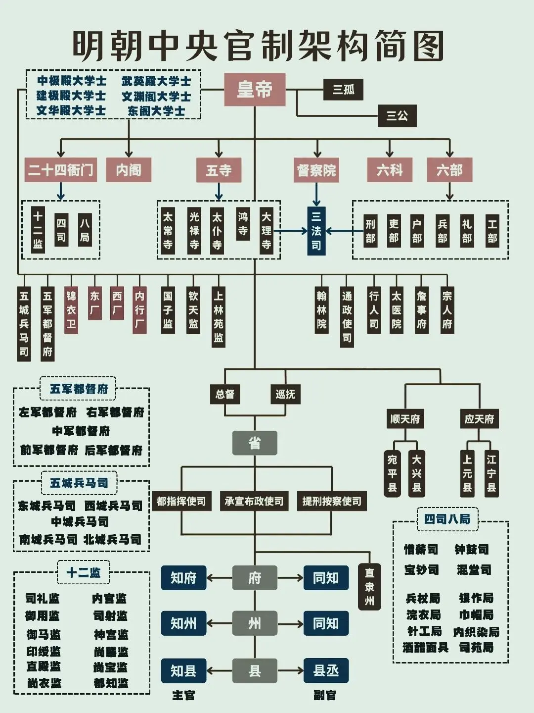

# 明朝內閣制：形成、演變與權力結構

## 歷史背景

明朝的**內閣制**並非一蹴而就，而是經歷了從「廢除丞相」到「輔助皇帝」的長期演變。其核心動機在於強化皇權與解決日益繁重的政務工作量之間的矛盾。

1380年（明洪武十三年），明太祖朱元璋藉由[胡惟庸案](../重大事件/洪武四大案/胡惟庸案.md)正式**廢除中書省與丞相職位**。隨後，權力重組，皇帝直接領導六部（吏、戶、禮、兵、刑、工）。雖然皇權空前強化，但行政重擔悉數匯集於皇帝一人，這也促使了輔助機構——內閣的誕生。

## 形成與演變

### 1. 雛形：殿閣大學士（洪武後期）

為了減輕負擔，朱元璋設立了「殿閣大學士」（如華蓋殿、文淵閣等）。

- **身分**：官階僅為正五品。
- **職能**：僅作為皇帝的**顧問**，負責陪侍、備詢或繕寫文書，不具備決策權。

### 2. 正式化與制度化（永樂年間）

1402年（明永樂元年），明成祖朱棣即位後，因常年出征與事務繁忙，正式選拔翰林院官員入駐文淵閣，參與機務。

- **內閣之名**：因辦公地點在宮內文淵閣（稱「內廷」），故稱「內閣」。
- **正式化**：內閣成為常設的輔政機構，成員開始擁有對國家政事的參預權。

### 3. 完整確立與鼎盛

內閣制在宣德年間達到完整確立。特別是在「三楊內閣」（楊士奇、楊榮、楊溥）主政時期，內閣擁有了實質行政權。

- **票擬制度**：大學士對奏章先擬定處理意見，寫在紙條（票）上送交皇帝，正式將內閣轉變為決策參謀機構。
- **部閣合一**：為了解決內閣官品過低的尷尬，大學士開始兼任六部尚書，實質上擁有了古代丞相統帥百官的權力，標誌著明朝文官政治的正式起點。

## 核心運行機制

### 票擬與批紅制度

這是明代中後期政務運行的基本SOP：

1. **進呈**：全國奏章統一送入內閣。
2. **票擬 (Piaoni)**：內閣大學士用黑筆在小條上寫下處理意見，附在奏章上。
3. **批紅 (Bihong)**：皇帝看過後若同意，則用紅筆照抄一遍，意見正式生效。

### 司禮監的權力介入：掌印與秉筆

明宣宗（朱瞻基）為了減輕負擔並制衡文官，在宮內設立「內書堂」教太監識字，使得政務決策權逐漸轉向「司禮監」。司禮監內部的權力分工，直接影響了內閣票擬的最終執行。

#### 1. 職位與職權對比

| 職位 | 核心職能 | 權力關鍵 | 地位 |
| :--- | :--- | :--- | :--- |
| **掌印太監** | 負責管理司禮監的印信（大印）。 | **最後審核權**：所有聖旨與公文必須蓋上大印才具備法律效力。 | 司禮監首領，地位最高，號稱「內相」。 |
| **秉筆太監** | 負責「批紅」，即代皇帝書寫對奏章的處理意見。 | **起草建議權**：將內閣票擬或皇帝旨意轉化為具體指令。 | 人數較多，地位僅次於掌印，但常隨侍皇帝左右。 |

#### 2. 權力運作流程

奏章在宮內的標準流程為：**內閣票擬** → **秉筆太監批紅** → **掌印太監蓋印**。

- **制衡關係**：秉筆太監雖有批紅權，但若掌印太監不滿意，可以拒絕蓋印，將公文退回。這種機制本意是為了防止單一宦官專權，但在實務中常演變成權力鬥爭。
- **大太監的誕生**：當皇帝讓同一個人兼任掌印與秉筆，或讓親信太監同時掌控此兩職時，就會產生如**劉瑾**、**魏忠賢**等權傾朝野的人物，徹底架空內閣。

### 選拔流程

確立了「**非進士不入翰林，非翰林不入內閣**」的嚴格選拔機制，確保內閣成員皆為文官集團中的菁英。

## 歷史影響與意義

- **強化皇權的雙刃劍**：內閣雖然協助皇帝處理政務，但也因其非正式的地位，導致權力來源高度依賴皇帝的信任。
- **宦官專權的誘因**：宣德皇帝教太監識字並讓其參與批紅，雖然初衷是制衡，卻為後世如王振、劉瑾、魏忠賢等宦官專權埋下禍根。
- **政治制度的轉向**：從法定的宰相制轉向皇帝私人顧問性質的內閣制，這是中國古代君主專制發展到高峰的重要標誌。

## 研究結論

明代內閣制是皇權極致擴張下的產物。它透過「票擬」與「批紅」的精密運作，雖然在特定時期（如三楊時期、張居正時期）極大地提高了行政效率，但也因權力制衡的扭曲（內閣 vs 司禮監）導致了中後期政治的極度腐敗與動盪。
