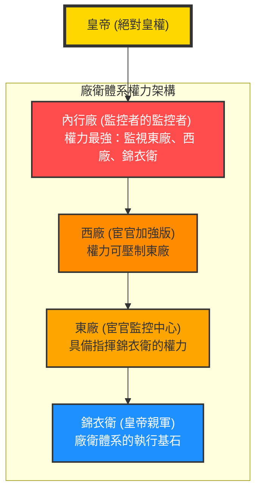

# 廠衛制度

廠衛制度是明朝特有的特務與監察體系，由「廠」（東廠、西廠、內行廠）與「衛」（錦衣衛）共同組成。其本質是皇帝繞過常規官僚體系（如六部、都察院），直接掌控情報與行政權力的私人工具。

---

## 1. 歷史背景與起源動機

廠衛機構的興起與明朝歷代皇帝的**政治需求與高度不安全感**息息相關：

- **錦衣衛 (1382年，洪武十五年)**：
  - **背景**：太祖朱元璋出身寒微，性格多疑且極度自卑。
  - **動機**：為了建立絕對皇權，將親軍改置為「錦衣衛」，下轄北鎮撫司，專責秘密偵緝，成為直接聽命於皇帝、獨立於國家常規司法機構之外的暴力機器。
- **東廠 (1420年，永樂十八年)**：
  - **背景**：成祖朱棣經[靖難之役](../重大事件/靖難之役.md)篡位，對建文帝舊臣及藩王極度猜忌。
  - **動機**：因宦官在靖難中屢建奇功，且當時錦衣衛指揮使紀綱圖謀不軌，朱棣認為親兵亦不可靠，遂設立由親信宦官提督的「東廠」，以牽制錦衣衛並監視朝野。
- **西廠 (1477年，成化十三年)**：
  - **背景**：憲宗時期發生方士李子龍勾結太監潛入大內事件，皇帝大為震驚。
  - **動機**：為防微杜漸，派太監汪直刺探情報並將其制度化，偵緝網迅速遍布全國。
- **內行廠 (1508年，正德三年)**：
  - **背景**：武宗時期權閹劉瑾專權。
  - **動機**：劉瑾為全面掌控特務機關並打擊異己，親自設立並指揮「內行廠」，形成了「三廠一衛」的龐大特務網絡。

---

## 2. 核心機構摘要

### 錦衣衛 - 基礎執行者

- **職權**：偵查官員、軍隊與民間動向；掌控「詔獄」。
- **特點**：由武官組成，是廠衛體系的執行基石。

### 東廠 - 宦官監控中心

- **職權**：蒐集全國情報，監視百官與錦衣衛；具備指揮錦衣衛的權力。
- **特點**：由司禮監宦官擔任首領，地位通常高於錦衣衛。

### 西廠 - 激進版特務

- **職權**：與東廠相似但編制更龐大，行事更殘酷，偵緝範圍延伸至民間瑣事。
- **特點**：兩度興廢，權力曾一度壓倒東廠。

### 內行廠 - 監控者的監控者

- **職權**：全方位監控官民，甚至監視東廠、西廠與錦衣衛，權力極端集中。
- **特點**：明朝權力最大的特務機構，隨劉瑾倒台而廢除。

---

## 3. 權力對比與關係演變

### 📊 特務機構權力對比表

| 機構       | 成立者 | 性質       | 掌控者      | 逮捕審訊 | 指揮權        |   權力強度   |
| :--------- | :----- | :--------- | :---------- | :------: | :------------ | :----------: |
| **錦衣衛** | 朱元璋 | 皇帝親軍   | 武官        |    ✅    | ❌ 基層執行   |    ⭐⭐⭐    |
| **東廠**   | 朱棣   | 宦官特務   | 太監        |    ✅    | ✅ 指揮錦衣衛 |   ⭐⭐⭐⭐   |
| **西廠**   | 朱見深 | 宦官加強版 | 太監        |    ✅    | ✅ 可壓制東廠 |  ⭐⭐⭐⭐⭐  |
| **內行廠** | 朱厚照 | 超級機構   | 太監 (劉瑾) |    ✅    | ✅ 統領全體   | ⭐⭐⭐⭐⭐⭐ |

---

### 📊 廠衛體系垂直關係圖

## 4. 社會與政治影響析論

廠衛制度在明朝歷史上留下了極其黑暗的一頁，對各個階層產生了毀滅性打擊：

### A. 對官員的摧殘：極端恐懼與人格喪失

- **無孔不入的監視**：官員私生活毫無隱私。早如宋濂請客的菜單、吳琳還鄉的細節皆被探知；晚至劉瑾時期，官員即使貶謫在家亦被盯梢。
- **肉體折磨與詔獄**：廠衛擁有不受法律約束的「詔獄」，如劉球因上疏建言遭肢解殺害。劉瑾更將「廷杖」改為脫衣受杖，使官員非死即殘。
- **尊嚴掃地**：文官集團骨氣被摧殘，許多人為自保向宦官阿諛，如工部郎中王佑為討好王振竟剃鬚自稱「兒子」。

### B. 對百姓的苦難：動輒得咎與敲詐勒索

- **恐怖氛圍蔓延**：特務勢力深入窮鄉僻壤，百姓見「京腔華服者」皆驚恐迴避。
- **羅織罪名與橫徵暴歛**：特務常為邀功無限放大罪狀。如江西百姓賽龍舟竟被西廠指控為「擅造龍舟」而抄家；富戶則常因懼怕牽連謀反大案而被迫行賄。

### C. 對國家的破壞：法制崩壞與動盪循環

- **司法體制瓦解**：廠衛完全繞過「三法司」（刑部、大理寺、都察院），使國家暴力機器淪為私人打擊政敵的工具。
- **引發內部兵變與背叛**：特務頭子權力膨脹後往往威脅皇權。如錦衣衛紀綱私藏武器、太監曹吉祥發動兵變、劉瑾私藏違禁品等。
- **惡性體制循環**：陷入「一瑾死，百瑾生」的怪圈，政治清明被毀，人性善意（如門達的轉變）被特務體制所吞噬。

---

## 5. 研究結論

廠衛制度是皇權對官僚體系高度不信任的產物。這種**監察權的私有化與暴力化**，雖然在短期內強化了皇帝的掌控，但最終卻以法制崩壞、官場腐敗與人性摧殘為代價。它不僅摧毀了文官集團的行政能力，更因特務機構的重疊與混亂，加速了明朝統治根基的動搖。

---

### 參考資料

1. [參考1](https://www.youtube.com/watch?v=4uaLh1dBrS0)
