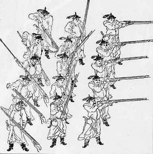
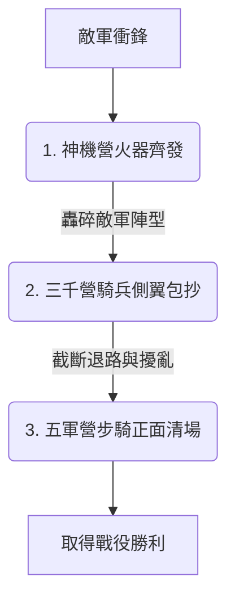

# 明朝京軍三大營：永樂盛世的國家拳頭部隊

## 歷史背景與創立宗旨

明成祖朱棣（1402年，明永樂元年）奪取皇位後，將大明帝國的首都自南方的南京遷往北方的北京，實行「天子守國門」的戰略。為直接面對北方蒙古（韃靼、瓦剌）的軍事壓力，並滿足其主動出擊、「犁庭掃穴」的戰略野心，朱棣在 [衛所制](./衛所制.md) 的兵源基礎上，抽調全國各地的衛所精銳（即「班軍」）齊聚京師，進行特種操練，進而創立了**「三大營」**。

三大營是明朝前期的中央常備軍與精銳主戰部隊，奠定了明朝「內重外輕」的軍事防禦格局。

---

## 三大營的軍種與職能解析

三大營並非單一兵種，而是將步兵、騎兵與火器特種部隊進行功能分工的精銳防衛體系：

### 1. 五軍營：大軍的中堅與步騎主力

- **編制軍種**：步兵與騎兵混編。
- **兵源構成**：主要由全國各衛所選拔的精銳步騎兵組成，編制最為龐大，是三大營的主力部隊。
- **戰術職能**：
  - 作為大規模戰役中的中軍主力，負責列陣對敵與正面對抗。
  - 明成祖在此親自訓練士兵在戰場上的陣型變換與步騎協同，是戰術協同的核心陣地。

### 2. 三千營：掌控戰場機動權的精銳騎兵

- **編制軍種**：重裝與輕裝騎兵。
- **兵源構成**：以歸附明朝的蒙古騎兵（如「兀良哈三衛」）為核心骨幹，配合漢人精銳騎兵組成。
- **戰術職能**：
  - 擔任大軍的「雷達隊」與「尖刀隊」，負責戰場偵察、外圍警戒、傳遞情報。
  - 在戰役中負責側翼包抄、切斷敵軍退路，以及在敵軍陣型混亂時發動快速突襲。
- **名稱由來**：初建時以三千蒙古精騎為骨幹而得名，後期實際兵力遠超此數，但番號沿用不變。

### 3. 神機營：劃時代的獨立火器部隊

- **編制軍種**：火器步兵與砲兵。
- **兵源構成**：明朝在征討交趾（今越南地區）時獲取了先進的火器技術，明成祖隨即下令成立了這支**世界歷史上最早的獨立火器部隊之一**。
- **戰術職能**：
  - 配備先進的神機箭、火銃、火砲等火器，負責在大軍對陣初期發動遠程火力轟擊，壓制並摧毀遊牧騎兵的衝鋒陣型。
- **核心戰術（三疊陣）**：
  - 為了克服早期火器裝填慢的致命缺點，神機營推行了「三疊陣」戰術（類似後世的排槍輪射）。將火器兵分為三排：第一排射擊、第二排準備、第三排裝填。當第一排射擊完畢後退至第三排裝填，原本的第二排上前射擊，以此循環，形成源源不絕的持續壓制火力。
    

---

## 戰術協同模式：「步、騎、砲」的降維打擊

明成祖五次親征漠北之所以能屢建奇功，正是依靠三大營「步、騎、砲」諸兵種的有機協同作戰：

1. **遠程轟擊**：敵軍發起衝鋒時，**神機營**居於陣前，火砲與火銃齊發，以猛烈的熱兵器火力打擊敵軍士氣，轟碎其衝鋒陣型。
2. **側翼突襲**：待敵方陣腳鬆動，**三千營**精銳騎兵迅速從側翼發動突擊，進行包抄、圍堵與機動打擊。
3. **正面合圍**：最後，**五軍營**的步兵與騎兵主力列陣推進，實行正面清場與合圍，完成收尾。

這種冷熱兵器結合的協同戰術，在15世紀初的東亞戰場上對遊牧民族形成了「降維打擊」。

---

## 歷史演變與局限性

- **前期鼎盛**：三大營在永樂年間（1402-1424年）戰力達到巔峰，是維護明朝北部邊疆穩定的核心支柱。
- **土木堡崩潰**：到了明朝中期，由於政治腐敗、軍紀渙散，加上衛所制度老化導致班軍素質下降。1449年（明正統十四年）在 [土木堡之變](../../重大事件/英宗危機與復辟/土木堡之變.md) 中，三大營精銳全軍覆沒。
- **改組與消亡**：土木堡之變後，兵部尚書于謙為重建京師防衛，打破三大營界限，創立了諸兵種混編的 [團營制](./團營制.md)。此後三大營雖曾有復建與重組，但明代京軍的核心作戰模式已逐漸向團營制及後期的募兵制演變。

---

### 相關歷史連結

- 基礎兵源體制：[衛所制.md](./衛所制.md)
- 繼承與改革制度：[團營制.md](./團營制.md)
