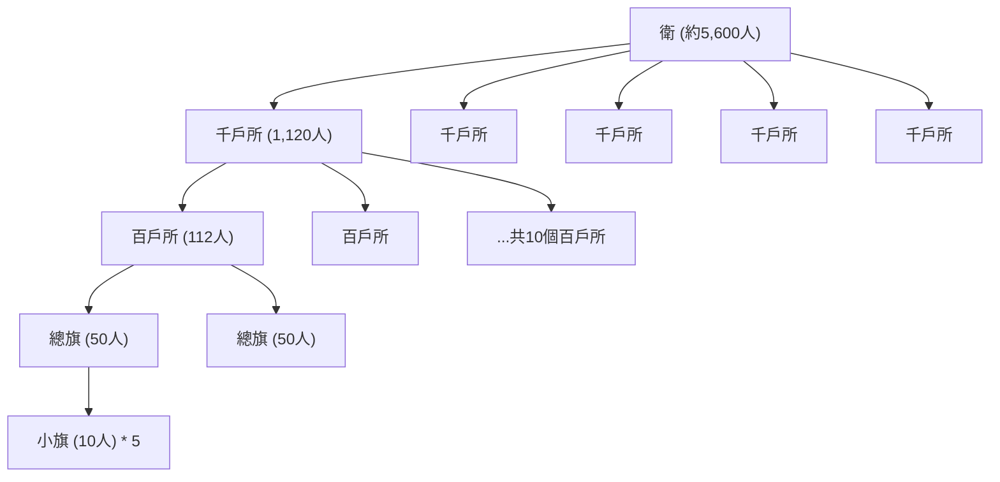

# 衛所制研究

## 一、歷史背景

明朝建立初期（1368年，明洪武元年），明太祖[朱元璋](../../皇帝/朱元璋.md)面臨著財政崩潰、百廢待興的局面，同時北方的蒙古殘餘勢力（北元）依然對新生政權構成嚴重威脅。為了在不增加國家財政負擔與百姓徭役的前提下，維持一支能夠隨時防範外敵、鎮壓內亂的龐大常備軍，朱元璋吸取了唐代府兵制與元代軍戶制的歷史經驗，創立了**衛所制**。

朱元璋曾對此制度深感自豪，曾言：

> 「吾養兵百萬，不費百姓一粒米。」

---

## 二、組織架構與指揮體系

### 1. 衛所組織編制

衛所制是明代的基本軍事組織形式。軍隊以「衛」與「所」為基本單位進行編制，其具體級階與人數如下：

- **衛（約5600人）**：設指揮使司，為衛的最高長官，下轄5個千戶所。
- **千戶所（約1120人）**：設千戶所，由千戶掌管，下轄10個百戶所。
- **百戶所（約112人）**：設百戶所，由百戶掌管，下轄2個總旗。
  - **總旗（50人）**：下轄5個小旗。
  - **小旗（10人）**：為最基層的軍事單位。

這些衛所遍布全國，特別集中於北方邊防重鎮（如大同、宣府、遼東）以及東南沿海防線，構成全國防禦網。

### 2. 中央指揮與調兵權分立

為了防止地方將領擁兵自重，朱元璋將軍權進行了分割，建立了中央集權的指揮體系：

- **統兵權（五軍都督府）**：明廷將大都督府拆分為[五軍都督府](../三權分立.md)（中、左、右、前、後都督府），掌管全國衛所的軍籍與軍政。
- **調兵權（兵部）**：調兵權則收歸中央六部之中的兵部，由皇帝直接控制。

戰時由皇帝委派總兵官（將領）率軍出征，戰後「將歸朝廷，兵回衛所」，實現「兵不識將，將不專兵」的制衡效果，從根本上避免了唐代中後期藩鎮割據的歷史教訓。這種制衡機制的詳細演變。

---

## 三、軍戶與軍屯制度

衛所制運作的核心在於其社會制度基礎：**軍戶世襲**與**軍屯自給**。

### 1. 軍戶世襲制度

配合明代的[戶籍制度](../戶籍制度.md)，全國人口被強制劃分為民戶、軍戶、匠戶等各種類別。

- **世代服役**：一旦被編入軍戶，其子弟必須世代承襲兵役，無權自由轉職。
- **親屬勾補**：一個軍戶家庭中，通常有一名壯丁（正丁）在衛所服役，其餘家庭成員（貼丁、次丁）在後方負責耕作以資助服役者。若正丁戰死、病故或老退，其家屬必須派遣其他男丁前往衛所遞補兵額，稱為「勾補」。

### 2. 軍屯自給自足

為了達到不費國帑的目標，衛所軍人實行「軍屯」制度：

- **兵農合一**：衛所官兵平時分工，通常實施「三分操備，七分屯種」（邊防重鎮則因形勢需要改為「二分操備，八分屯種」）。
- **自耕自足**：屯種士兵耕作國家分配的「屯田」（軍田），收成除繳納少許屯糧外，主要用於供給自身及操備士兵的口糧與軍需，免除了朝廷轉運軍餉的財政開支。
- **後勤協同**：在邊防防線，由於屯田產出有限，朝廷另輔以[開中法](../開中法.md)，招募商人運糧至邊境換取鹽引，以保障邊軍的日常物資供給。

---

## 四、衛所制度的崩潰與後期無法執行的原因

到了明朝中後期（約15世紀中葉以後），隨著社會經濟的發展與官僚體制的腐敗，衛所制逐漸失去原有的功能，最終名存實亡。其崩潰原因主要有以下五點：

### 1. 土地兼併與軍屯破產

隨著政治日趨腐敗，衛所長官、外戚及地方豪強大肆鯨吞、霸佔軍屯土地。原本屬於國有的軍田逐漸轉化為權貴的私人莊田，導致屯田制度徹底破產。基層軍戶失去了賴以維生的土地，生活陷入絕境，無力負擔兵役。

### 2. 軍戶地位低下與逃亡空額

軍戶身分低下，且長期遭到衛所軍官的剝削。軍官往往將士兵當作私人奴役，逼迫他們修築私宅、耕種私田，士兵尊嚴盡失。在沉重的經濟與人身壓迫下，軍戶開始大規模逃亡，或賄賂地方官吏脫籍。
這導致衛所兵額嚴重空虛，出現「有官無兵」的窘境，空餉現象泛濫。

### 3. 兵農分離名存實亡與戰鬥力衰退

衛所兵本質上為半農半兵，缺乏專業的軍事訓練。到了中期，操練流於形式，士兵裝備破舊不堪。
在**土木堡之變**（1449年，明正統十四年）中，由二十餘萬衛所精銳組成的京軍在面對蒙古瓦剌軍隊時一觸即潰，皇帝被俘，暴露了衛所制戰鬥力徹底喪失的現實。事後，明廷雖嘗試以于謙創立的[團營制](./團營制.md)改革京軍[三大營](./三大營.md)，但仍無法扭轉地方衛所防務的崩潰。

### 4. 衛所軍官腐敗與世襲僵化

衛所軍官職位世襲，導致軍中階級固化，無能與腐敗者充斥其間。軍官普遍克扣軍餉、虛報兵額（吃空餉），並將衛所公物據為己有，使得軍心渙散，士兵毫無鬥志。

### 5. 募兵制逐漸取代

由於衛所軍戰鬥力低下，在面對嘉靖年間（16世紀中葉）猖獗的東南倭寇與北方韃靼威脅時，朝廷不得不採用招募職業軍人的**募兵制**。
其中最具代表性的即為戚繼光建立的「戚家軍」（創立於1559年，明嘉靖三十八年）。募兵為拿取軍餉的職業軍人，接受嚴格的專業戰術訓練，戰鬥力遠超衛所農兵。

---

## 五、明末的實際狀況

到了明朝末年（17世紀初，如1644年，明崇禎十七年），衛所制度已經徹底解體：

1.  **防務主力轉移**：國防力量完全依賴於邊防的募兵（例如遼東邊軍）以及將領依靠高薪供養的個人私人部隊——**「家丁」**。
2.  **家丁制弊端**：家丁制雖然保障了核心戰鬥力，但軍隊的私人屬性極強，導致將領權力膨脹，形成了明末武將不聽朝廷號令的軍閥化傾向（詳見[軍閥問題比較](./軍閥問題比較.md)）。
3.  **社會階層退化**：原有的衛所體系僅餘下世襲的空頭軍銜，衛所土地大多轉手，軍戶亦與一般民戶無異。

---

## 六、歷史影響與研究結論

### 1. 歷史貢獻

- **減輕財政負擔**：在明朝立國之初財政極度空虛的情況下，衛所制以極低的成本維持了龐大的軍事防禦網絡，穩固了新生政權。
- **加強中央集權**：配合兵部與五軍都督府的分權設計，有效杜絕了地方軍隊的軍閥化，維護了明初至前期的政治穩定。

### 2. 歷史局限與歷史定位

- **不符合經濟規律**：將軍人身分與戶籍永久世襲化，限制了社會人口流動，與明中葉以後商品經濟的發達與雇傭關係的普及格格不入。
- **缺乏自我修復機制**：軍屯制度無法有效抵抗官僚地主的土地兼併。一旦軍戶失去土地，整個制度的連鎖支柱便隨之瓦解。

**總體而言**：
衛所制是中國古代「兵農合一」思想在明代特定歷史條件下的具體實踐。它在明初發揮了巨大的國防與財政效益，但其制度設計的僵化性，使其無法適應中後期的經濟與社會變革，最終被迫退場，讓位給職業化的募兵制。
