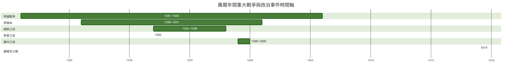

# 明神宗朱翊鈞（萬曆）

## 歷史背景

- **承接隆慶遺澤與政局變革**：1572年（明隆慶六年），明穆宗[朱載垕](./朱載垕.md)病逝，年僅十歲的皇太子朱翊鈞即位，改元萬曆。隆慶朝推行的「俺答封貢」與「隆慶開海」穩定了邊防並改善了財政，但內閣權爭與官場積弊仍存。首輔[高拱](../人物/文臣/高拱.md)因與司禮監秉筆太監馮保交惡，遭馮保與次輔[張居正](../人物/文臣/張居正.md)聯手排擠罷官，形成「宮相結合」（李太后、馮保、張居正）的中樞共治架構。
- **財政與經濟轉型期**：嘉靖朝長年修道與戰事造成的國庫虧空雖有緩解，但土地兼併嚴重、戶籍隱匿猖獗、官紳優免賦役過甚，朝廷歲入仍顯窘迫。與此同時，東南沿海貿易因開海政策蓬勃發展，美洲白銀海量流入，市場經濟與貨幣體系加速轉向白銀本位。
- **邊防新態勢與周邊格局**：北方因俺答汗受封而維持和平；東北遼東女真建州部等暗中蓄力；西南播州、雲貴等地土司勢力錯綜複雜；而日本正值安土桃山時代，豐臣秀吉逐漸統一日本列島，野心漸次膨脹，東亞國際地緣政治醞釀劇烈變局。

## 核心生平與事蹟

### 幼年登基與張居正改革時代（1572年－1582年，萬曆元年至十年）

- **宮相共治與帝王規訓**：幼年朱翊鈞生活在李太后的嚴厲管教與首輔[張居正](../人物/文臣/張居正.md)的嚴苛教育之下。張居正編撰《帝鑑圖說》，以極高道德標準規範幼帝之一言一行，凡見皇帝有稍涉逸樂之苗頭（如臨池寫字、賞賜近侍）即嚴詞奏劾。萬曆皇帝自幼被作為道德符號培養，個人意志長期受到壓抑。
- **推行萬曆新政**：在皇帝全力信任與太后支持下，張居正推行「考成法」整飭吏治，嚴格考核官吏政績；丈量全國田畝以打擊瞞報；全面落實[張居正經濟改革](../經濟/張居正經濟改革.md)（一條鞭法），將賦役合併徵銀。軍事上起用[戚繼光](../人物/武將/戚繼光.md)修築薊鎮長城、李成梁經略遼東，國庫太倉粟充盈，史稱「萬曆中興」。

### 親政、清算帝師與信仰崩潰（1582年－1586年，萬曆十年至十四年）

- **清算張居正與馮保**：1582年（明萬曆十年），張居正病逝，十九歲的萬曆帝正式親政。隨後朝臣彈劾張居正專權跋扈、壓制言路，萬曆帝查抄張府時發現張居正生前私德奢華、蓄積巨萬，與其平日高調提倡的節儉清廉形象大相徑庭。萬曆帝遭受嚴重的認知失調與被欺騙感，隨即下旨削奪張居正官秩、籍沒家產，放逐司禮監掌印太監馮保。
- **對文官道德說教的極度幻滅**：帝師人設的崩塌促使萬曆皇帝徹底擺脫儒臣的精神束縛，轉為對文官集團的道德標榜產生深刻懷疑與制度性不信任。

### 國本之爭與怠政真相（1586年－1620年，萬曆十四年至四十八年）

- **[爭國本](../事件/萬曆時期/爭國本.md)的權力死結**：1586年（明萬曆十四年），鄭貴妃誕下皇三子朱常洵並晉封皇貴妃。萬曆帝愛屋及烏，意欲廢長立幼，打破[朱元璋](./朱元璋.md)在《皇明祖訓》中確立的「有嫡立嫡，無嫡立長」之鐵律。文官官僚集團視此為捍衛道統禮法的底線，掀起長達十五年的「國本之爭」。歷經申時行、王家屏、王錫爵、趙志皋、沈一貫五任內閣首輔更迭與數百名言官廷杖、削籍，萬曆帝最終於1601年（明萬曆二十九年）被迫妥協冊立皇長子朱常洛為皇太子。此場意志博弈的全面挫敗，徹底摧毀了萬曆皇帝的臨朝施政熱情。
- **[萬歷怠政](../事件/萬曆時期/萬歷怠政.md)的消極反抗**：萬曆皇帝開創了明代帝王「近三十年不上朝」之先例，以「不郊、不廟、不朝、不見、不批、不講」的消極態度對文官集團實施被動攻擊。他利用皇帝獨佔的審批權，對大臣奏章實行「留中不發」，並拒絕補缺官吏，致使中央六部尚書多有空缺、地方撫按官職大面積癱瘓。同時，萬曆帝頻繁頒布[中旨](../制度/中旨.md)繞過[內閣制](../制度/內閣制.md)，進一步加劇君臣對立。
- **定陵考古醫學的生理實證**：長期以來，文官指責皇帝因沉溺「酒色財氣」而自甘墮落。1957年定陵發掘與現代醫學骨骼鑑定證實，萬曆皇帝生前患有嚴重的脊柱側彎（駝背極深），且右腿明顯短於左腿、肌肉萎縮重度跛行，行走需人攙扶，步履伴隨劇烈神經與關節疼痛。明廷「御門聽政」要求天子於清晨端立受百官瞻拜，皇帝為維護皇權尊嚴與掩蓋生理殘疾，深居宮闈成為其保護自我自尊的防衛機制。

### 帝國武功：萬曆三大征（1592年－1600年，萬曆二十年至二十八年）

儘管深居大內，萬曆皇帝在重大軍事決策上仍展現出果斷的戰略眼光與調度魄力，主導了名震後世的「萬曆三大征」：

- **[寧夏之役](../事件/萬曆時期/寧夏之役.md)（1592年）**：蒙古降將哱拜勾結套虜發動叛亂，萬曆帝調派魏學曾、葉夢熊、李如松督軍，引黃河水灌寧夏城，迅速平定叛亂，穩固西北塞防。
- **[朝鮮戰爭](../事件/萬曆時期/朝鮮戰爭.md)（萬曆援朝之役，1592年－1598年）**：日本豐臣秀吉率軍侵略朝鮮，朝鮮求援。萬曆帝力排朝臣「坐視不理」的怯戰議論，堅定派李如松、麻貴、邢玠、劉綎等率大軍兩度東渡援朝，在中朝軍民奮戰下重創日軍，促成豐臣政權崩解，奠定東亞三百年和平格局。
- **[播洲之役](../事件/萬曆時期/播洲之役.md)（1599年－1600年）**：西南播州宣慰司楊應龍起兵叛亂，威脅四川、貴州、湖廣。萬曆帝起用李化龍總督八省軍務，分兵八路合圍海龍屯，徹底剿滅楊氏政權，加速了西南「改土歸流」的進程。
- **綜合軍事評估**：三大征均取得戰術全勝，保全藩屬並鞏固疆界（參見 [萬曆三大征的影響](../事件/萬曆時期/萬曆三大征的影響.md) 與 [明緬戰爭](../事件/萬曆時期/明緬戰爭.md)）。

### 財政壓榨與礦稅風暴

- **營建工程與國庫空竭**：三大征耗費軍費逾千萬兩白銀，加之萬曆帝大規模修築定陵、乾清坤寧兩宮及皇極殿大火後的重建工程，以及福王大婚耗銀三十餘萬兩，造成國庫極度窘迫。
- **廣派宦官與[礦稅](../制度/礦稅.md)民變**：為直接搜刮內帑，萬曆帝繞過戶部，大量派出太監擔任礦監、稅使奔赴天下各地開礦徵稅。宦官貪暴勒索、橫行鄉里，嚴重阻礙商業流通，激發各地士民強烈抗暴（如[雲南礦稅案](../事件/萬曆時期/雲南礦稅案.md)及臨清、蘇州市民民變）。
- **海外白銀流入之支撐**：在礦稅掠奪的同時，萬曆朝繼續落實[萬曆時期的開海政策](../事件/萬曆時期/萬曆時期的開海政策.md)，東南沿海的大帆船貿易每年為大明帝國帶來源源不斷的海外白銀，成為晚明商品經濟得以維繫的重要支柱。

### 遼東危局與薩爾滸之戰（1619年，明萬曆四十七年）

- **建州女真之興起**：在明軍主力疲於內外征伐之際，建州女真首領努爾哈赤利用明廷對女真諸部的平衡政策，逐步吞併海西女真、統一女真各部，並於1616年（明萬曆四十四年）稱汗建立後金。
- **[薩爾滸之戰](../事件/萬曆時期/薩爾滸之戰.md)**：1618年（明萬曆四十六年），努爾哈赤發布「七大恨」誓師攻明，陷撫順、清河。1619年（明萬曆四十七年），萬曆帝起用楊鎬經略遼東，集結全國精銳十萬兵分四路圍剿後金。努爾哈赤採取「憑爾幾路來，我只一路去」的各個擊破戰術，薩爾滸之戰明軍三路大敗，文武名將折損殆盡。此戰徹底扭轉遼東戰局，明朝自此完全轉入戰略防守。
- **駕崩與傳位**：1620年（明萬曆四十八年七月），萬曆皇帝病重駕崩，在位四十八年，終年五十七歲。廟號神宗，諡號顯皇帝，葬於定陵。皇太子朱常洛繼位，為明光宗（泰昌帝）。

## 歷史影響與後世評價

- **「明之亡，實亡於神宗」的史論檢視**：《明史·神宗本紀》贊曰：「論者謂：明之亡，實亡於神宗。」此論主要歸因於神宗長期怠政致使政務廢弛、言路壅塞、內閣與官僚系統斷層，促成晚明「東林黨爭」的極端白熱化；同時礦稅害民、遼東處置失策，為明廷敗亡埋下深厚禍根。
- **被掩蓋的帝王權術與戰略決斷**：近代學者亦指出，神宗並非傳統史家筆下軟弱昏聵之主。他在萬曆三大征中的果決任事、在「國本之爭」中堅持長達十餘年的政治意志，展現出極強的自主性與帝王心術。他不上朝卻仍牢牢掌控兵權、人事免罷與特務特權，從未使皇權旁落於內閣或宦官首領手中。
- **生理殘疾與體制困局的共振**：神宗之悲劇，在於專制皇權的高度中央集權與君王生理重殘、心理創傷之間的致命不可調和。明代官僚制度賦予皇帝最終批決權，而缺乏皇帝怠政時的有效代理決策機制，導致君臣長期的互耗演變為國家中樞機能的自毀。
- **晚明社會繁榮與啟蒙思潮**：儘管朝廷政治僵化，民間社會在萬曆時期迎來商業經濟的高峰，市民文化繁榮、通俗小說戲曲興盛，西方傳教士利瑪竇等人來華傳播西學，李贄等反傳統思想家輩出，呈現出朝廷昏聵與民間活力並存的複雜時代特徵。

## 研究結論

明神宗朱翊鈞是明代在位時間最長、最具性格衝突與政治矛盾的帝王。其統治歷程清晰地劃分為兩個截然不同的階段：少年時代在張居正輔弼下開拓「萬曆中興」，展現守成英主的潛力；親政後卻因帝師信仰幻滅、身患嚴重骨疾跛足難以踐履朝儀，以及「國本之爭」中皇權意志遭遇文官集團集體阻擊，進而轉入長達數十年的「被動怠政」。

神宗既能在三大征中坐鎮深宮決策萬里，擊退強敵、維護東亞地緣安全；又因放任朝政空缺、大興礦稅與兵敗薩爾滸，使明帝國財政與軍事元氣大傷。他的「怠政」本質上是一場專制君主對體制規範的報復性抗爭，卻以帝國機體的全面衰敗為代價。「明亡於神宗」之定評，道出了個人殘缺、權力死結與帝國宿命相互交織的歷史沉思。

## 參考資料
