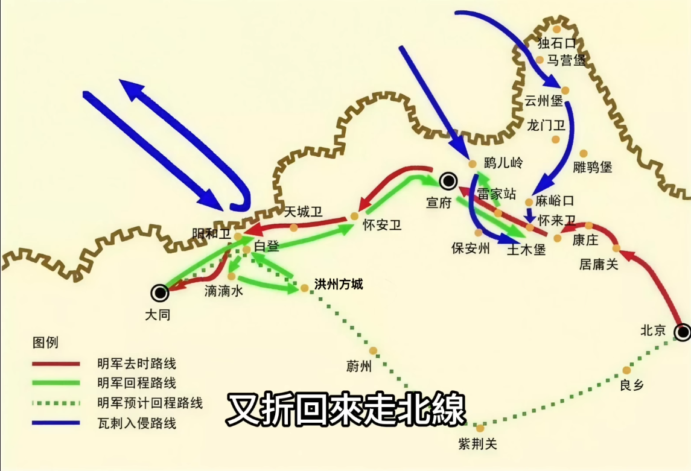
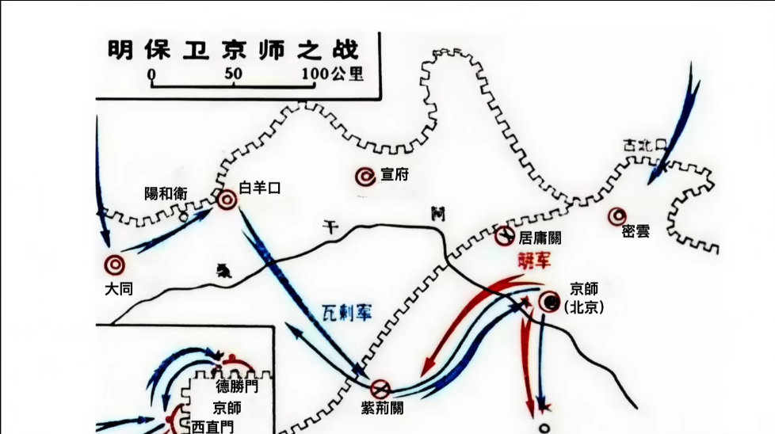

# 北京保衛戰 (1449年，明正統十四年/景泰元年)

## 歷史背景：社稷危如累卵

[土木堡之變](./土木堡之變.md)後，明朝精銳盡喪，英宗被俘。瓦剌首領也先企圖以英宗為籌碼（奇貨可居），在邊境要塞（大同、宣府）勒索財物，耽誤了56天，為北京贏得了寶貴的整備時間。然而，當瓦剌大軍逼近時，朝廷內部一度出現遷都之議，情勢極其嚴峻。

---

## 核心人物：社稷之臣于謙

于謙（1398-1457），字廷益，錢塘人。

- **志向與性格**：少有大志，敬仰文天祥，作《石灰吟》自勉。為官十九年，兩袖清風，深得民心。
- **臨危受命**：在「午門血案」中，文官集團徹底壓制了宦官勢力。當時群臣在午門伏地大哭，要求處置王振黨羽，王振心腹錦衣衛馬順竟厲聲斥責百官，觸發眾怒。給事中王竑率先衝上前撕咬馬順之肉，隨後百官一擁而上，將馬順及毛貴、王長隨三人在朝堂上當場毆殺。在局面極度混亂、郕王驚恐退場之際，于謙挺身而出攔住朱祁鈺，力陳此舉乃「為民除害」而非反叛，成功穩定政局並隨即升任兵部尚書，正式主導北京防禦。

---

## 核心決策與危機處理

### 1. 政治定力：擁立新君

為了打破也先利用英宗勒索的政治空間，孫太后起初命郕王朱祁鈺為「監國」。隨後，在于謙等文官集團的強力主導下，為避免「敵有所挾則邀求無厭」，決定擁立新帝。朱祁鈺起初因擔憂亡國責任及倫理尷尬而再三推辭，于謙以「臣等誠憂國家，非為私計」一語定人心，強調此舉乃為社稷而非私利。朱祁鈺最終於九月登基，尊英宗為「太上皇」。孫太后雖同意此舉，但堅持保留英宗之子朱見深的太子地位，為日後的政治風暴埋下伏筆。此決策使英宗瞬間失去籌碼價值，穩定了內部政局並統一了保衛戰的指揮權。

### 2. 軍事動員與兵力整補

- **拼湊大軍**：在京師精銳全滅的情況下，緊急從河南、山東、南北直隸調集「備操軍」、「備倭軍」與「運糧軍」，收編殘部，組建起22萬人的守軍。
- **改革軍制**：創立「團營」，解決部隊各自為政、指揮不靈的問題。

### 3. 後勤奇蹟：全民搶運通州糧

通州糧倉存糧極豐，為防落入敵手，于謙祭出「全民運輸」方案：

- **官兵獎勵**：運糧進城即預發半年俸祿。
- **百姓商運**：每車運20石糧進城賞銀一兩。
  此舉在瓦剌抵達前，成功將糧食全數移入京城。

---

## 戰鬥過程：九門外的決死戰

于謙堅決反對死守城內，主張「背水一戰」，將22萬大軍布防於京城九門之外，並**下令鎖死城門**，斷絕所有退路。

- **德勝門之戰 (主力對決)**：于謙親自坐鎮。利用「神機營」伏擊也先主力，誘敵深入後火器齊發，也先胞弟及大量精銳在此戰中被炸死。
- **西直門之戰**：將領孫鏜在退路被鎖死的情況下被迫背水一戰，配合城頭火器與石亨的援軍，成功擊退敵軍。
- **彰義門之戰**：雖一度因太監騎兵亂陣而陷入苦戰，但在援軍支援下最終化解瓦剌攻勢。

---

## 歷史影響與研究結論

1449年10月15日，也先見久攻不下且大明各地勤王軍將至，被迫撤兵。

- **拯救大明**：此戰避免了明朝重演「靖康之恥」或南遷偏安的命運，延續了國祚。
- **政治格局轉向**：文官集團（由于謙領導）在戰爭中展現了極強的組織能力，從此在明朝政局中壓制了宦官與軍頭勢力。
- **于謙的歷史定位**：于謙以其清廉與鐵腕，在國家最黑暗的時刻撐起了脊樑。雖日後在「奪門之變」中被害，但其保衛社稷之功始終為後世景仰。

---

### 參考資料

1. [參考1](https://www.youtube.com/watch?v=keCeQRMLcSo)
2. [參考2](https://www.youtube.com/watch?v=JI0ULqiJxI8)

---

