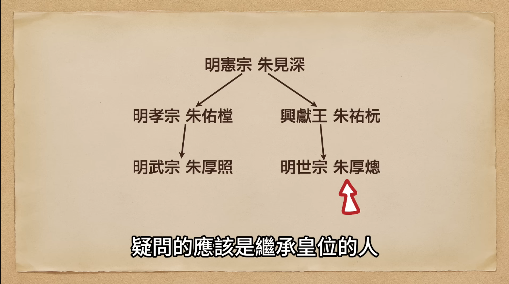
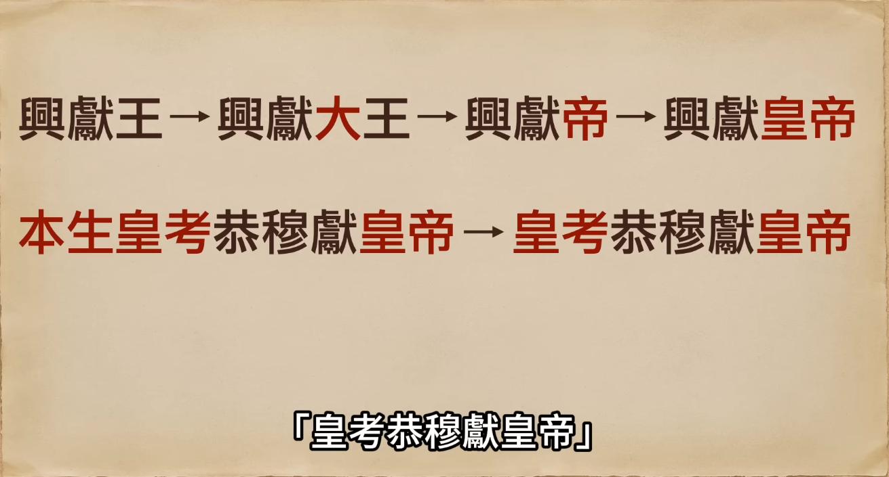

# 大禮儀

## 歷史背景

明正德十六年（1521年），明武宗朱厚照崩逝，因無子且無親兄弟，內閣首輔楊廷和依「兄終弟及」祖制，選立興獻王長子朱厚熜入繼大統，即嘉靖皇帝。隨後因嘉靖欲追封親生父母尊號，與文官集團爆發了長達三年的禮法爭論，史稱「大禮儀」。

## 核心內容摘要

### 1. 嘉靖皇帝繼位之因

- **法理基礎**：遵循「兄終弟及」原則。因武宗無子，選立與其血緣最近的叔父興獻王一脈。
  
- **政治算計**：首輔楊廷和與張太后認為嘉靖年幼（約 14、15 歲）且父喪無靠，將其扶上皇位有助於朝臣和太后繼續掌控朝政大權。

### 2. 文官集團的反對依據

- **「小宗入繼大宗」原則**：楊廷和等「繼嗣派」主張嘉靖是以地方藩王身分繼承皇位，法理上必須過繼給明孝宗（武宗之父）為嗣子，尊明孝宗為「皇考」，而稱親生父母為「皇叔父/母」。
- **理法與天理**：士大夫認為維護宗法制度下的等級秩序（天理）高於世俗人情。如果允許皇帝隨意破壞「小宗入大宗」的禮制，等同於破壞了儒家與皇權相互制衡的運作基礎。
  
- **歷史判例的法理背書**：文官集團引經據典，提出前朝相似案例作為依據：
  - **漢朝先例**：漢成帝無子，立侄子劉欣（漢哀帝）為太子，劉欣隨即過繼至漢成帝法統，確立了「繼嗣」的合法性。
  - **宋朝「濮議」事件**：宋仁宗無子，過繼趙曙（宋英宗）繼位。當時朝廷展開長達 18 個月的論戰，最終確認英宗名義上為仁宗繼子，僅能稱親生父親為「皇伯」，而未能加上皇帝尊號。
  - **理學理論**：引用大儒程頤的主張，強調既然繼承了他人的家業（皇位），就理應成為其後代並履行祭祀義務。

### 3. 嘉靖皇帝的奪權與鎮壓

- **理論支持**：利用張璁提出的「繼統不繼嗣」主張，為追尊親生父母找到法理依據。
- **政治權術**：嘉靖善用「留中不發」、情感勒索（揚言罷工退位）等手段。對於主心骨楊廷和，則順勢批准其辭職以削弱反對派勢力。
- **左順門事件**：嘉靖三年（1524年），面對 200 多名官員的伏闕請願，嘉靖動用錦衣衛血腥鎮壓，廷杖 180 多人，當場打死 17 人，徹底瓦解文官集團的抵抗。

### 4. 嘉靖的「正名」與治術

- **改名與權威**：嘉靖熱衷於透過改名（如奉天殿改為皇極殿、賜名大臣、題寫「六必居」）來彰顯天子權威與控制人心。
- **制衡術**：採取「既用你也防著你」的策略，在首輔身後安插新人相互牽制，頻繁更換首輔（如楊廷和、楊一清、張璁、夏言、[嚴嵩](../../角色/嚴嵩.md)、徐階）以防權臣尾大不掉。

## 關鍵人物：張璁（後賜名張孚敬）

### 1. 政治豪賭與仕途

- **尋求捷徑**：張璁中進士時已 47 歲，若按部就班難以進入權力核心。他敏銳察覺大禮儀中的僵局是「政治插隊」的絕佳機會，遂率先上疏支持嘉靖，博取青睞。
- **思想背景**：深受王陽明「心學」影響，主張「順人情故謂之禮」，認為禮法不應違背人倫情感，以此挑戰傳統的「宋儒理學」。

### 2. 個人事蹟與升遷

- **南下與回歸**：初因得罪楊廷和被貶南京，卻因此結交桂萼等心學盟友。後被嘉靖召回掌管禮儀，任翰林學士。
- **位極人臣**：嘉靖十年（1531年）官拜大學士，後升任**內閣首輔**。因其名「璁」與皇帝名「熜」發音相近，被嘉靖親自賜名為「張孚敬」。

### 3. 政治結局

- **權力棋子**：雖是大禮儀的第一功臣，但在嘉靖無情的制衡術下，最終也只是皇帝輪番替換首輔、玩弄權力遊戲中的一枚棋子。

## 歷史影響與意義

大禮儀不僅是名分之爭，更是皇權對相權（文官集團）的全面勝利。嘉靖皇帝透過此事件確立了絕對威權，但也暴露出其好用小聰明、怠於政事的風格，導致大明王朝自此逐漸走向衰亡。

## 研究結論

嘉靖皇帝是一位精通權術的統治者，他將「正名」視為鞏固皇權的利刃。張璁的興起則反映了明代中葉心學思想對傳統禮教的強大衝擊，個人仕途的成功與政治理論的創新在大禮儀中達到了高度的結合。

---

## 參考資料

1. [參考1](https://www.youtube.com/watch?v=IMRvPz_vpSM)
2. [參考2](https://www.youtube.com/watch?v=8hAQb3G9280)
