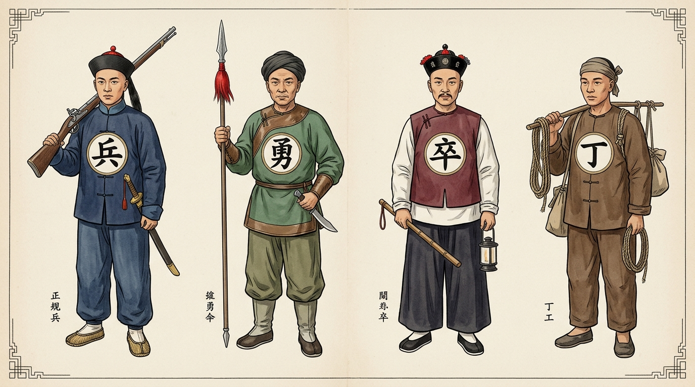

# 兵勇卒丁

## 歷史背景

在清朝的軍事與地方行政體系中，官兵、鄉勇、差役與後勤人員在服飾（胸前與背後）上印有「兵」、「勇」、「卒」、「丁」等文字標記。這些字樣並非單純的服飾裝飾，而是清代嚴格的身份識別、編制分類、薪餉待遇與統轄系統之標示，堪稱清代基層軍警與後勤體系的「身份識別碼」。

清初承襲明制並結合滿洲八旗制度，確立了八旗與綠營雙軌正規軍體制。隨後在清中後期經歷太平天國運動等內部危機，軍事體制發生結構性變革。同時，地方行政與後勤勞役體系亦透過「卒」與「丁」進行清晰的職能劃分。

## 制度架構與核心內容

### 1. 清代兵勇卒丁四大類別比較

| 身份標記 | 隸屬系統           | 編制屬性               | 主要職能                           | 薪餉待遇與來源                         | 歷史演變與特點                             |
| :------- | :----------------- | :--------------------- | :--------------------------------- | :------------------------------------- | :----------------------------------------- |
| **兵**   | 中央與國家正規軍   | 世襲正規編制（鐵飯碗） | 邊防駐屯、京師衛戍、鎮壓叛亂       | 國家財政撥給（鐵桿莊稼），八旗高於綠營 | 分為八旗與綠營，清前期軍事主力             |
| **勇**   | 地方士紳/勇營系統  | 臨時招募/後轉正規勇營  | 戰時應徵、作戰打仗、鎮壓民變       | 早期微薄計件，晚期由地方釐金與糧餉保障 | 由早期臨時雇傭兵演變為晚期國家主導軍力     |
| **卒**   | 地方府州縣衙門     | 地方行政差役編制       | 維持地方治安、緝捕、巡邏、看管獄囚 | 地方衙門支應或規費汲取                 | 非軍隊系統，相當於近代警察與基層城管       |
| **丁**   | 地方後勤與各業勞役 | 底層體力勞力/後勤人員  | 運送糧草、修築城役、庫房與專業勞役 | 勞務報酬或徵發徭役                     | 非作戰人員，按從事行業區分（庫丁、鹽丁等） |

### 2. 「兵」：國家正規軍體系（八旗與綠營）

- **八旗兵**：
  - **體制與來源**：清朝開國之根本，由滿洲八旗、蒙古八旗與漢軍八旗組成。
  - **駐防佈局**：分為駐紮京師之「禁旅八旗」與駐防全國戰略重鎮之「駐防八旗」。
  - **待遇與世襲**：享受最高規格之津貼與配給，軍餉高於地方七品知縣，兵額世襲代代相傳，俗稱「鐵桿莊稼」（即世襲鐵飯碗）。
- **綠營兵**：
  - **體制與來源**：清軍入關後招撫明朝降軍及招募漢人組建，以綠旗為標誌，故稱綠營或綠旗兵。
  - **駐防佈局**：兵額龐大（常年保持四十五萬至六十萬人），分駐全國各省、府、州、縣，擔負地方守備與邊防任務。
  - **待遇與世襲**：待遇雖次於八旗兵，但同樣屬於國家財政列餉之正規世襲編制。

### 3. 「勇」：臨時雇傭軍至勇營制度之轉型

- **早期臨時雇傭**：
  - 當正規「兵」額不足或戰事緊迫時，官府臨時招募鄉勇應急，戰事結束即行解散，無固定編制，薪餉按件發放，常被視為戰場消耗品。
- **咸豐年間之結構性巨變**：
  - 1851年（清咸豐元年）太平天國運動爆發，長期處於和平環境之八旗與綠營戰力嚴重腐化崩潰。
  - 清廷被迫授權地方士紳組織團練鄉勇，曾國藩之湘軍與李鴻章之淮軍應運而生。
  - 「勇」打破早期臨時性質，形成「兵隨將轉、餉由將籌」之勇營制度，配備精良武器與高額軍餉，轉變為清末國家最核心之軍事支柱。

### 4. 「卒」：地方衙門治安與執法體系

- **職能與隸屬**：
  - 「卒」不歸兵部或軍隊系統管轄，隸屬於地方府、州、縣衙門。
  - 負責堂前護衛、巡邏街巷、押解犯人、看管監獄及維護城門秩序，職能相當於近現代之警察、治安官與獄政人員。
- **字源考釋與歷史脈絡**：
  - 古文字學中，「卒」之甲骨文象衣上帶有標記或縫合之形。《禮記·曲禮》載：「天子死曰崩，諸侯曰薨，大夫曰卒」，引申為終結與完畢。
  - 服飾上印「卒」字，既代表其為衙門公職差役之身份標記，亦代表執法與約束之終點。

### 5. 「丁」：後勤保障與民政勞役人員

- **字義與身份定義**：
  - 「丁」源於古代對成年初字壯丁之稱呼（如「成丁」），引申指代從事特定職業或勞役之人員。
- **類別與分工**：
  - **軍事後勤**：不直接參與前線戰鬥，專責運輸糧草、修築城牆堡壘、搬運軍需物資。
  - **行業後勤**：如看管官庫之「庫丁」、鹽場勞動與運銷之「鹽丁」、管理園林之「園丁」、協助徵稅之「稅丁」等。
- **戰時狀態**：戰亂爆發時，底層「丁」常被官府強行徵調（抓壯丁）充當陣前軍需民夫。

## 歷史影響與崩潰原因

### 1. 軍事體制的基層解構與地方化

清代從「兵」到「勇」的重心轉移，反映了中央集權軍事體制的衰落。八旗與綠營世襲制的腐化，使朝廷不得不依賴「勇」（湘軍、淮軍）。此一演變直接導致晚清「軍餉自籌、兵權私有」的地方軍閥化雛形，深刻影響了後來的洋務運動與民初軍閥格局。

### 2. 基層社會治理與職能專業化

「兵、勇、卒、丁」的嚴格標記，體現了清代基層治理中軍事、警察、後勤與民政徭役的初步職能分工。雖然「卒」與「丁」地位較低且常有勒索鄉里之弊，但其分類模式為近代地方警察制度與民政體系的建立奠定了雛形。

## 研究結論

清代服飾上的「兵、勇、卒、丁」四字標記，是清代軍事體制、行政層級與基層社會結構的縮影。從正規世襲的「兵」、應變崛起的「勇」，到地方治安的「卒」與後勤勞役的「丁」，這四個字精準勾勒出清代社會的權利分配、軍餉來源與階層劃分。對此四類身份的釐清，有助於深入理解清代軍制變遷、太平天國時期的社會動態以及晚清國家機器治理能力的演變。

## 參考資料

1. [參考1](https://www.facebook.com/watch/?ref=saved&v=2029964050934079&locale=zh_TW)
