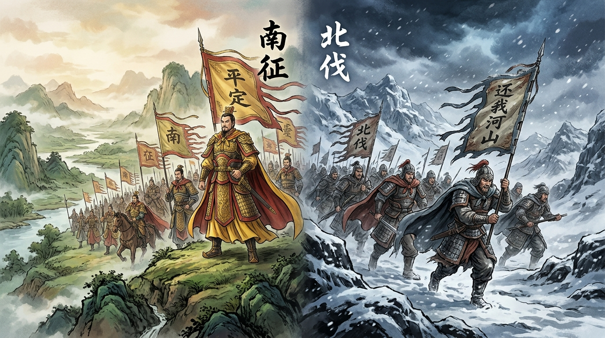

# 南征北伐

在中國古代戰爭史與軍事文獻中，「南征」與「北伐」絕非隨意的地理方向描述，而是蘊含著深刻政治正統性、戰略意圖、將士心理與戰爭性質的軍事術語體系。

---

## 歷史背景

### 1. 「征」與「伐」的字義探源與古文字考釋

- **「征」之字義與政治意涵**：
  - **古文字考釋**：甲骨文中「征」字最早寫作「正」，後加入雙人旁「彳」組成「征」，表示行軍奔走。其本意為以武力使偏離者「回歸正道」（匡正、正統）。
  - **上位者姿態**：征代表上位者對下位者的武力制裁與秩序重組。發動者通常居於政治與文化正統的絕對優勢地位。
  - **戰略目標與手段**：征的核心並非摧毀滅族，而是懲戒、教化與收服人心（「打是為了服，不是為了殺」）。其過程帶有懷柔與納入統治體系的包容性。
- **「伐」之字義與戰鬥意涵**：
  - **古文字考釋**：甲骨文中「伐」字象形為一把「戈」架在人的脖子上，刃口穿透頸部，直觀呈現流血砍殺之意。其本意為斬斷、討伐與清剿。
  - **復仇者姿態**：伐代表復仇者、被壓迫者或正義之師對暴虐者、佔領者或宿敵的不死不休之搏鬥。
  - **戰略目標與手段**：伐的核心是徹底剷除、復仇雪恨、收復失地與斬草除根（「打是為了血恨，求的是根除」），絕無懷柔妥協之餘地。

### 2. 中原正統、地理格局與出兵心態

古代中原正統王朝的核心腹地長期位於北方中原地區（黃河流域）。在中原王朝視角中：

- **向南出兵**：南方偏遠之地多被視為割據政權或邊陲少數族群（如南蠻、山越）。中原王朝以天下共主自居，向南出兵被定義為「南征」，意在將其匡正納入華夏文明體系。
- **向北出兵**：當中原腹地淪陷、朝廷被迫南渡偏安（如東晉、南宋、蜀漢）時，北方佔領者被視為奪我家園之仇敵與篡權偽朝。偏安政權向北出兵被定義為「北伐」，凝聚著國破家亡的悲憤與收復中原的歷史使命。

---

## 制度架構與核心內容

### 1. 「征」與「伐」四大維度比較

| 比較維度     | 「征」（如南征、北征）         | 「伐」（如北伐、討伐）             |
| :----------- | :----------------------------- | :--------------------------------- |
| **政治姿態** | 上對下、居高臨下、華夏正統匡正 | 復仇反擊、背水一戰、漢賊不兩立     |
| **戰略目的** | 震懾、歸順、教化、納入帝國體系 | 剷除、收復故土、報仇雪恨、推翻暴政 |
| **戰爭手段** | 攻心為上、打了又放、懷柔撫綏   | 掃平割據、流血斬首、絕不妥協       |
| **將士心境** | 底氣十足、勝券在握、重建秩序   | 國破家亡之悲憤、壯烈決絕           |

### 2. 經典歷史案例剖析

- **「南征」典範：諸葛亮平定南中（225年，蜀漢建興三年）**：
  - **背景**：蜀漢建立初期，南方南中地區孟獲等叛亂。
  - **戰略核心**：採納馬謖「攻心為上，攻城為下；心戰為上，兵戰為下」之策略。
  - **實踐與影響**：執行「七擒七縱」，目的並非屠殺滅族，而是徹底收服南中各部人心，使後方長治久安，為後續北伐曹魏奠定穩固基礎。此乃「征」之懷柔精髓。
- **「北伐」典範：祖逖、岳飛與諸葛亮北伐**：
  - **祖逖北伐（313年，西晉建興元年）**：西晉永嘉之亂後，祖逖率部北渡長江，中流擊楫發誓「不清中原，絕不再渡」，帶著失去故土的滿腔悲憤奮勇反擊。
  - **岳飛北伐（1140年，南宋紹興十年）**：金兵南侵、二帝被擄。岳飛帶領岳家軍北伐，喊出「還我河山」之口號，直導黃龍，屬於生生死死、收復失地的復仇聖戰。
  - **諸葛亮北伐（228年～234年，蜀漢建興六年～十二年）**：蜀漢承襲東漢正統，諸葛亮六出祁山，發表《出師表》，誓言「興復漢室，還於舊都」，彰顯「漢賊不兩立，王業不偏安」的生死對決。
- **討伐暴政：「伐無道」與「替天行道」**：
  - **陳勝吳廣起義（前209年，秦二世元年）**：喊出「伐無道，誅暴秦」，戰略目標非勸秦朝改過，而是推翻暴政。
  - **周武王伐紂（前1046年，周武王元年）**：討伐商紂王，最終於牧野之戰後將商紂王首級懸於旗桿，展現「伐」的徹底毀滅與政治更迭。
- **語境例外考釋：極盛中原王朝的「北征」**：
  - **漢武帝征匈奴（前129年，漢元光六年）**與**明太祖洪武北征（1368年，明洪武元年）**：當中原王朝處於絕對強勢地位時，出兵北方游牧民族稱為「北征」（如漢武帝征匈奴、朱元璋派徐達與常遇春洪武北征）。因中原王朝自居絕對正統上位者，將匈奴與北元視為邊患與下位者，出兵旨在震懾驅離而非復仇。

---

## 歷史影響與戰略意義

### 1. 政治合法性與正統論之建構

在古代中國政治學中，「征」與「伐」的選詞直接關係到政權合法性的構建。稱「征」強調自身為天下共主、順天應人；稱「伐」則強調師出有名、替天行道或復國大義。兩種稱謂構成了古代名分秩序的重要一環。

### 2. 戰略動員與集體心理引導

戰爭術語直接影響了部隊的戰術風格與士氣心理。「南征」之師講求規律撫綏與基層治理；「北伐」之師則凝聚著極強的民族情感與政治使命感，能夠激發將士背水一戰的壯烈戰鬥力。

---

## 研究結論

「南征」與「北伐」在中國歷史上不僅是地理方向的差異，更是中國古代政治哲學、正統意識與戰爭倫理的核心反映。「征」代表了中原王朝上位者的底氣、懷柔與秩序重構；「伐」則凝結了失地政權與被壓迫者的背水一戰與絕絕復仇。一字之差，深刻詮釋了古代中國戰爭背後的動機、姿態與歷史宿命。

---

## 參考資料

- [參考1](https://www.facebook.com/watch/?ref=saved&v=1058654900664520&locale=zh_TW)
