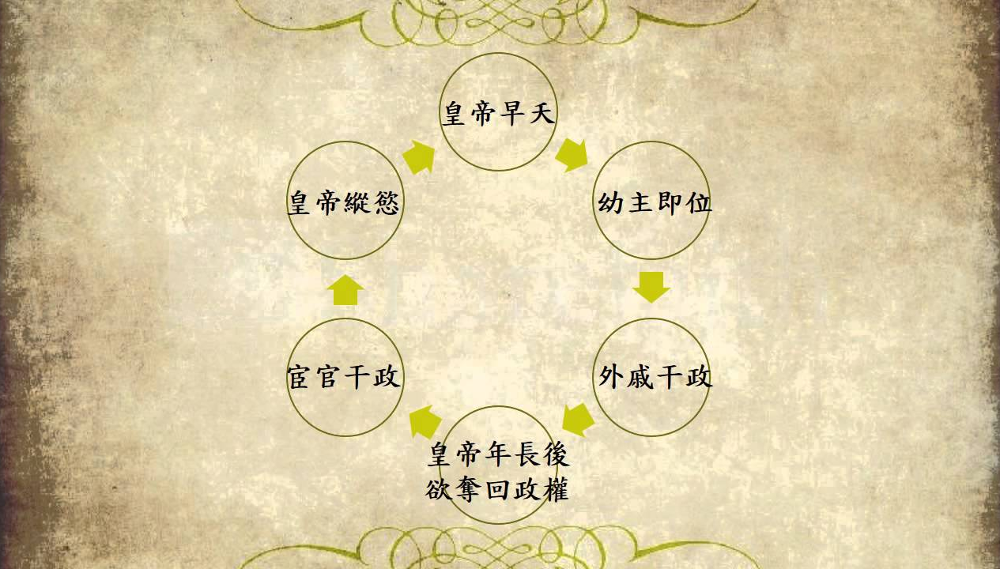

# 外戚政治

外戚政治是中國古代君主專制體制下的一種特殊政治現象。本文全面總結外戚的定義、興起背景、歷代演變脈絡、經典歷史案例，以及外戚與宦官、皇位繼承權之間的深層互動關係，藉此剖析君主專制權力的運作邏輯。

---

## 歷史背景

### 1. 外戚的定義

外戚，又稱「母黨」或「妻黨」，是指皇帝母親（太后）或配偶（皇后）的娘家親族。在朝廷上，他們通常以國舅、太師、大司馬、大將軍等顯赫身分出現，成為外廷官僚與內廷皇權之間的特殊紐帶。

### 2. 外戚興起的深層政治邏輯

在古代君主專制與家天下的政治架構下，當遇到皇帝年幼（幼主即位）時，朝廷往往由皇太后臨朝稱制（垂簾聽政）。這為外戚政治的興起提供了客觀條件：

- **信任危機**：太后身居深宮，在朝廷中缺乏直接的政治班底，且面臨文官集團的天然排斥。
- **尋求外援**：為了鞏固權力並對抗官僚集團，太后最能信任且最便於動用的勢力，即為其父兄子弟。這使外戚得以合法進入國家權力核心，掌握軍政大權。

---

## 制度架構與核心內容

### 1. 歷代外戚政治演變脈絡

外戚勢力在中國歷史上經歷了「興起、鼎盛、惡性循環、壓制、防範」的演變過程：

| 朝代         | 外戚政治特徵                                                                                                                                                                                   | 代表人物                     | 命運與結局                                                            |
| :----------- | :--------------------------------------------------------------------------------------------------------------------------------------------------------------------------------------------- | :--------------------------- | :-------------------------------------------------------------------- |
| **西漢**     | **政治合夥人** 君權與外戚關係較為融洽，朝廷大膽重用並多授予軍權。                                                                                                                           | 衛青、霍去病、霍光、王莽     | 前期戰功赫赫，後期發展為權臣篡位，如西元9年（新始建國元年）王莽代漢。 |
| **東漢**     | **權力惡性循環** 陷入「幼主即位 $\rightarrow$ 太后臨朝 $\rightarrow$ 外戚專權 $\rightarrow$ 皇帝成年 $\rightarrow$ 聯手宦官誅殺外戚 $\rightarrow$ 宦官專權 $\rightarrow$ 皇帝早逝」的循環。 | 竇憲、梁冀                   | 外戚與宦官兩敗俱傷，最終導致東漢政權的分崩離析。                      |
| **魏晉唐宋** | **防範與轉型** 曹魏立法禁止外戚輔政；唐中晚期因武則天之鑑而壓制女禍；宋代實行「豢養政策」，給予恩爵財富而不授以實權。                                                                       | 長孫無忌、武三思、劉太后親族 | 外戚勢力逐漸邊緣化，無法動搖朝政根本。                                |
| **明朝**     | **草根選妃制** 實施後妃選自民間清白女子或低階軍戶之制，娘家毫無政治背景。                                                                                                                   | 馬皇后親族、張太皇太后親族   | 徹底杜絕了外戚專權的可能，多出賢后。                                  |
| **清朝**     | **制度化與隱形化** 實施嚴格的八旗選秀與內務府制度，切斷後宮與外廷的直接聯繫。                                                                                                               | 隆科多、桂祥（慈禧太后之弟） | 外戚轉為皇子爭奪繼承權的隱形籌碼，失去獨立專權能力。                  |

### 2. 經典外戚案例分析

- **衛青與霍去病（西漢）**：
  - **背景**：因漢武帝寵幸衛子夫，其娘家人衛青、霍去病得以被起用。在漢武帝元朔、元狩年間（西元前128年至前119年），二人多次領兵出征。
  - **歷史評介**：他們憑藉絕頂的軍事才能，七征匈奴、封狼居胥，成為大漢帝國的軍事支柱，是歷史上少數立下不世之功的正面外戚典範。
- **王莽（西漢）**：
  - **背景**：其姑姑王政君為西漢皇太后，王氏一門五侯，權傾天下。
  - **歷史評介**：王莽生活清苦、禮賢下士，將自己塑造為儒家道德楷模。最終於西元9年（新始建國元年）順應輿論進行禪讓，篡漢建立新朝。
- **霍光（西漢）**：
  - **背景**：漢武帝託孤重臣。西元前74年（西漢元平元年），漢昭帝駕崩且無子嗣，霍光主導迎立昌邑王劉賀為帝。
  - **歷史評介**：因劉賀進京後急於提拔親信、試圖架空霍光，霍光僅用27天便聯合上官皇太后（其外孫女）強行廢黜劉賀。
- **梁冀（東漢）**：
  - **背景**：其妹二人先後為后（漢順帝、漢桓帝時期），把持朝政近二十年。
  - **歷史評介**：梁冀囂張跋扈。西元146年（東漢本初元年），年僅八歲的漢質帝因私下稱其為「跋扈將軍」，梁冀便指使廚師在餅中投毒將其鴆殺。後於西元159年（東漢延熹二年）被漢桓帝聯手宦官剷除。
- **馬皇后親族（明朝）**：
  - **背景**：明太祖朱元璋的結髮妻子馬皇后的親族。
  - **歷史評介**：西元1368年（明洪武元年）朱元璋稱帝後，意欲封賞馬皇后親族，馬皇后嚴詞拒絕，認為官爵應予賢能，外戚無功不應私授官職。這種政治智慧為明代外戚的低調保平安定下了基調。

---

## 歷史影響與崩潰原因

### 1. 東漢「外戚與宦官」的生死博弈

東漢中後期的政治本質是「皇權代理人的爭奪戰」，這也是東漢政權崩潰的主因之一：

- **代理奪權**：小皇帝年幼時，由太后與外戚代理皇權。
- **宦官反殺**：小皇帝成年後，為奪回控制權，只能依靠日常起居接觸的宦官，聯手發動宮廷政變誅殺外戚。
- **循環覆滅**：政變成功後皇權轉入宦官手中（閹黨專權），直至下一任幼主登基、外戚重新掌權，形成惡性循環。這種結構性的權力衝突，嚴重削弱了東漢的統治根基。
  

### 2. 清代「母以子貴」與繼承權之爭

到了清朝，外戚失去了直接干政的管道，後宮的鬥爭核心轉向「皇位繼承權」的隱性爭奪：

- **生存法則**：後宮實行「母以子貴」。若皇子成功即位，母親即成為太后，其家族亦得享恩榮；若奪嫡失敗，母子及其家族往往面臨嚴酷的政治邊緣化。
- **秘密建儲制的影響**：西元1723年（清雍正元年）雍正帝創立「祕密建儲制」後，明目張膽的結黨營私被嚴厲禁止。因此，外戚對繼承權的爭奪轉化為對皇子的菁英式培養與形象包裝，以爭取皇帝在與詔書上落筆時的青睞。

---

## 研究結論

中國古代外戚政治的興衰史，本質上是**「君主專制皇權不斷加強、制度防範日趨嚴密」**的縮影。從漢代的「政治合夥人」到明清的「徹底豢養與邊緣化」，皇帝透過制度建設（如草根選妃、祕密建儲），成功將權力收歸君主一身，防範了外戚干政之禍，但這也反映了帝國後期中央集權體制日益僵化、缺乏政治彈性的歷史趨勢。

---

## 參考資料
